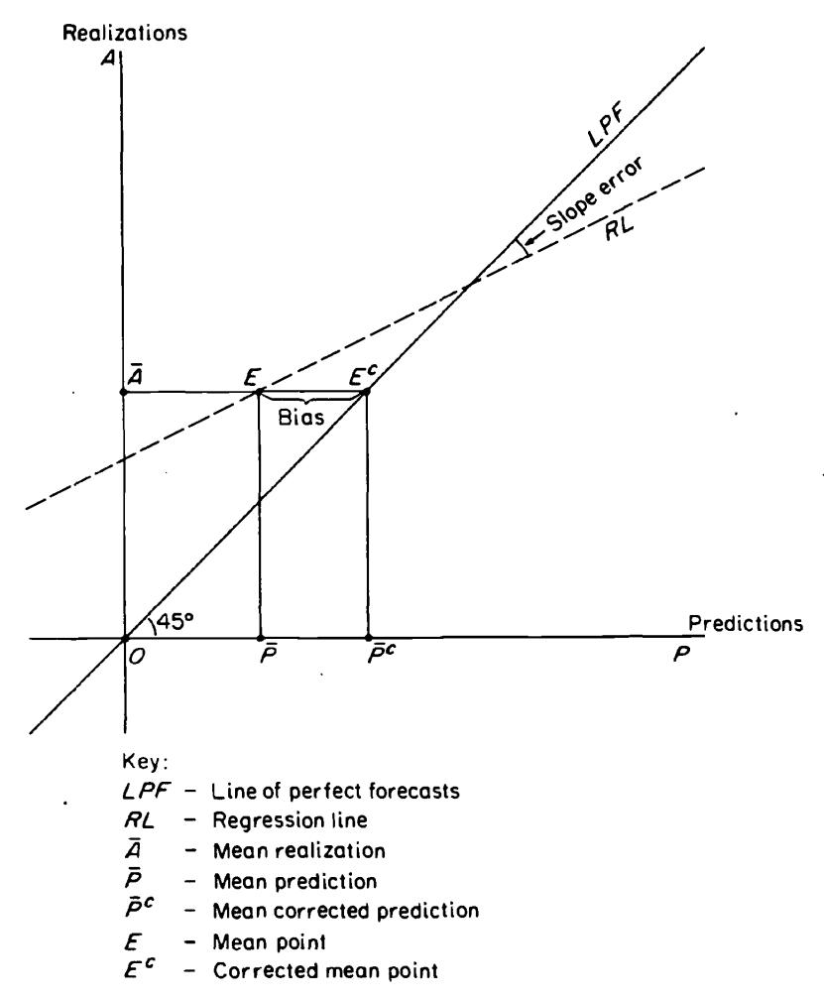

This PDF is a selection from an out-of-print volume from the National Bureau of Economic Research

Volume Title: Economic Forecasts and Expectations: Analysis of Forecasting Behavior and Performance

Volume Author/Editor: Jacob A. Mincer, editor

Volume Publisher: NBER

Volume ISBN: 0-870-14202-X

Volume URL: http://www.nber.org/books/minc69-1

Publication Date: 1969

Chapter Title: The Evaluation of Economic Forecasts

Chapter Author: Jacob A. Mincer, Victor Zarnowitz

Chapter URL: http://www.nber.org/chapters/c1214

Chapter pages in book:  $(p. 3 - 46)$

## ECONOMIC FORECASTS AND EXPECTATIONS

 $\circ$

 $\label{eq:2.1} \frac{1}{\sqrt{2}}\left(\frac{1}{\sqrt{2}}\right)^{2} \left(\frac{1}{\sqrt{2}}\right)^{2} \left(\frac{1}{\sqrt{2}}\right)^{2} \left(\frac{1}{\sqrt{2}}\right)^{2} \left(\frac{1}{\sqrt{2}}\right)^{2} \left(\frac{1}{\sqrt{2}}\right)^{2} \left(\frac{1}{\sqrt{2}}\right)^{2} \left(\frac{1}{\sqrt{2}}\right)^{2} \left(\frac{1}{\sqrt{2}}\right)^{2} \left(\frac{1}{\sqrt{2}}\right)^{2} \left(\frac{1}{\sqrt{2}}\right)^{2} \left(\$  $\label{eq:2.1} \frac{1}{\sqrt{2}}\sum_{i=1}^n\frac{1}{\sqrt{2}}\sum_{i=1}^n\frac{1}{\sqrt{2}}\sum_{i=1}^n\frac{1}{\sqrt{2}}\sum_{i=1}^n\frac{1}{\sqrt{2}}\sum_{i=1}^n\frac{1}{\sqrt{2}}\sum_{i=1}^n\frac{1}{\sqrt{2}}\sum_{i=1}^n\frac{1}{\sqrt{2}}\sum_{i=1}^n\frac{1}{\sqrt{2}}\sum_{i=1}^n\frac{1}{\sqrt{2}}\sum_{i=1}^n\frac{1}{\sqrt{2}}\sum_{i=1}^n\frac$  $\mathcal{L}(\mathcal{L})$  and  $\mathcal{L}(\mathcal{L})$  $\label{eq:2.1} \mathcal{L}(\mathcal{L}(\mathcal{L})) = \mathcal{L}(\mathcal{L}(\mathcal{L})) = \mathcal{L}(\mathcal{L}(\mathcal{L})) = \mathcal{L}(\mathcal{L}(\mathcal{L}))$  $\mathcal{L}(\mathcal{L}(\mathcal{L}))$  . The set of  $\mathcal{L}(\mathcal{L})$  $\label{eq:2.1} \mathcal{L}_{\mathcal{A}}(\mathcal{A})=\mathcal{L}_{\mathcal{A}}(\mathcal{A})\otimes\mathcal{L}_{\mathcal{A}}(\mathcal{A})\otimes\mathcal{L}_{\mathcal{A}}(\mathcal{A})$

#### **ONE**

# The Evaluation of Economic Forecasts

### JACOB MINCER AND VICTOR ZARNOWITZ

## **INTRODUCTION**

An economic forecast may be called "scientific" if it is formulated as a verifiable prediction by means of an explicitly stated method which can be reproduced and checked.1 Comparisons of such predictions and the realizations to which they pertain provide tests of the validity and predictive power of the economic model which produced the forecasts. Such empirical tests are an indispensable basis for further scientific progress. Conversely, as knowledge accumulates and the models improve, the reliability of forecasts, viewed as information about the future, is likely to improve.

Forecasts of future economic magnitudes, unaccompanied by an explicit specification of a forecasting method, are not scientific in the above sense. The analysis of such forecasts, which we shall call "business forecasts," is nevertheless of interest.2 There are a number of reasons for this interest in business forecasts:

[NOTE: Numbers in brackets refer to bibliographic references at the end of each chapter.

1 The definition is borrowed from Henri Theil [7, pp. 10 ff.].

2 In practice, sharp contrasts between scientific economic model forecasts and business forecasts are seldom found; more often, the relevant differences are in the degree to which the predictions are explicit about their methods, and are reproducible. Information on the methods is not wholly lacking for the business forecasts, nor is it always fully specified for econometric model predictions. Note also that distinctions between unconditional and conditional forecasting, or between point and interval forecasts are not the same as between scientific and nonscientific forecasts. The latter are usually unconditional point predictions, but so can "scientific" forecasts be. [Cf. 7, p. 4.]]

1. To the extent that the predictions are accurate, they provide information about the future.

2. Business forecasts are relatively informative if their accuracy is not inferior to the accuracy of forecasts arrived at scientifically, particularly if the latter are more costly to obtain.

3. Conversely, the margin of inferiority (or superiority) of business forecasts relative to scientific forecasts serves as a vardstick of progress in the scientific area.

4. Regardless of the predictive performance ascertainable in the future, business forecasts represent a sample of the currently prevailing climate of opinion. They are, therefore, a datum of some importance in understanding current economic behavior.

5. Even though the methods which produce the forecasts are not specified by the forecasters, it is possible to gain some understanding of the genesis of forecasts by relating the predictions to other available data.

In this paper we are concerned with the analysis of business forecasts for some of these purposes. Specifically, we are interested in methods of assessing the degree of accuracy of business forecasts both in an absolute and in a relative sense. In the Absolute Accuracy Analysis (Section I) we measure the closeness with which predictions approximate their realizations. In the Relative Accuracy Analysis (Section II) we assess the net contributions, if any, of business forecasts to the information about the future available from alternative, relatively quick and cheap methods. The particular alternative or benchmark method singled out here for analysis is extrapolation of the past history of the series which is being predicted. The motivation for this choice of benchmark is spelled out in Section II. It will be apparent, however, that our relative accuracy analysis is suitable for comparisons of any two forecast methods.

The treatment of extrapolations as benchmarks against which the predictive power of business forecasts is measured does not imply that business forecasts and extrapolations constitute mutually exclusive methods of prediction. It is rather plausible to assume that most forecasts rely to some degree on extrapolation. If so, forecast errors are partly due to extrapolation errors. Hence, an analysis of the predictive performance of extrapolations can contribute to the understanding and assessment of the quality of business forecasts. Accordingly, we proceed in Section III to inquire into the relative importance of extrapolations in generating business forecasts, and to study the effects of extrapolation error on forecasting error.3

All analysts of economic forecasting owe a large intellectual debt to Henri Theil, who pioneered in the field of forecast evaluation. A part of the Absolute Accuracy Analysis section in this paper is an expansion and direct extension of Theil's ideas formulated in [8]. Our treatment, indeed, parallels some of the further developments which Theil recently published.4 However, while the starting point is similar, we are led in different directions, partly by the nature of our empirical materials, and partly by a different emphasis in the conceptual framework. The novel elements include our treatment of explicit benchmark schemes for forecast evaluation, which goes beyond the familiar naive models to autoregressive methods; our attempt to distinguish the extrapolative and the autonomous components of the forecasts; and our analysis of multiperiod or variable-span forecasts and extrapolations.

The empirical materials used in this paper consist of eight different sets of business forecasts, denoted by eight capital letters, A through H. These forecasts are produced by groups of business economists, economic departments of large corporations, banks, and financial magazines. Most use is made here, for illustrative purposes, of a subgroup of three sets of forecasts, E, F, and G, which represent a large opinion poll and small teams of business analysts and financial experts. The data for all eight sets summarize the records of several hundred forecasts, all of which have been processed in the NBER study of short-term economic forecasting.5 It is worth noting that our substantive conclusions in this paper are broadly consistent with the evidence based on the complete record. A summary of the analyses and of the findings is appended for the benefit of the impatient reader.

3 For an analysis of a particular extrapolation method, known as "adaptive forecasting" see Jacob Mincer, "Models of Adaptive Forecasting,"Chapter 3 in this volume.

4 Theil [7, Chapter 2, especially pp. 33-36].

5 For a detailed description of data and of findings, see [13].

## I. ABSOLUTE ACCURACY ANALYSIS

#### ERRORS IN PREDICTIONS OF LEVELS

At the outset, it will be helpful to state a few notations and definitions:  $A_{t+k}$  represents the magnitude of the realization at time  $(t + k)$ ; and  $_{t+k}P_t$ , the prediction of  $A_{t+k}$  at time t. The left-hand subscript of P is the target date, the right-hand subscript is the base date of the forecast; and  $k$  is the time interval between forecast and realization, also called the forecast span.

Although the terms "forecast" and "prediction" are synonyms in general usage, we shall reserve the former to describe a set of predictions produced by a given forecaster or forecasting method, and pertaining to the set of realizations of a given time series  $A$ . Single predictions  ${}_{t+k}P_t$  are elements in the set, or in the forecast P, just as single realizations  $A_{t+k}$  are elements in the time series A. Different forecasts (methods or forecasters) may apply to the same set of realizations, but not conversely.6

Consider a population of constant-span (say,  $k = 1$ ) predictions and realizations of a time series  $A$ . The analytical problem is to devise comparisons between forecasts  ${}_{t}P_{t-1}$  and realizations  $A_t$  which will yield useful descriptions of sizes and characteristics of forecasting errors  $u_t = (A_t - P_{t-1}).$

A simple and useful graphic comparison is obtained in a scatter diagram relating predictions to realizations.7 As Figure 1 indicates, a perfect prediction ( $u_t = 0$ ) is represented by a point on the 45° line through the origin, the line of perfect forecasts (LPF). Clearly, the smaller the dispersion around LPF the more accurate is the forecast. A measure of dispersion around LPF can, therefore, serve as a measure of forecast accuracy. One such measure, the variance around LPF, is known as the *mean square error of forecast*. We will denote it by

7 The "prediction-realization diagram" was first introduced by Theil in [8, pp. 30 ff.].

6 For some purposes, not considered in this paper, the converse may be admissible. A forecaster may be evaluated by the performance of a number of forecasts he produced, each set of predictions pertaining to different sets of realizations.

 $M_P$ . Its definition is:

$$
\tag{1} \hspace{1cm} M_P = E(A-P)^2,
$$

where $E$  denotes expected value. Preference for this measure as a measure of forecast accuracy is based on the same considerations as the preference for the variance as a measure of dispersion in conventional statistical analysis: This is its mathematical and statistical tractability. We note, of course, that this measure gives more than

FIGURE 1-1. The Prediction-Realization Diagram

proportionate weight to large errors, an assumption which is not particularly inappropriate in economic forecasting.8

The square root of  $M_P$  measures the average size of forecast error, expressed in the same units as the realizations. The expression $M_p = 0$ represents the unattainable case of perfection, when all points in the prediction-realization diagram lie on LPF. In general, most points are off LPF. However, special interest attaches to the location of the *mean point*, defined by  $[E(A), E(P)]$. The forecast is *unbiased* if that point lies on LPF, that is if  $E(P) = E(A)$. The difference  $E(A) - E(P) = E(u)$  measures the size of bias. The forecast systematically underestimates or overestimates levels of realizations, if the sign of the bias is positive or negative, respectively.

Unbiasedness is a desirable characteristic of forecasting, but it does not, by itself, imply anything about forecast accuracy. Biased forecasts may have a smaller  $M_P$  than unbiased ones. However, other things being equal, the smaller the bias, the greater the accuracy of the forecast. The "other things" are the distances between the points of the scatter diagram: Given that  $E(P) \neq E(A)$ , a translation of the axes to a position where the new LPF passes through the mean point will produce a mean square error,  $M'_p$ , which is smaller than the original  $M_p$ . This is because the variance around the mean is smaller than the variance around any other value.

Formally, we have:

$$
M_P = E(A - P)^2 = E(u^2) = [E(u)]^2 + \sigma^2(u) \tag{2}
$$

and

$$
M_P'=\sigma^2(u).
$$

The presence of bias augments the mean square error by the mean component $[E(u)]^2$. The other component of $M_p$, the variance of the error around its mean, $\sigma^2(u)$, is an (inverse) measure of forecasting efficiency.

Further consideration of the prediction-realization scatter diagram yields additional insights into characteristics of forecast errors. Thus nonlinearity of the scatter indicates different (on average) degrees of over- or underprediction at different ranges of values. Its heteroscedasticity reflects differential accuracy at different ranges of values.

8 From a decision point of view, this measure is optimal under a quadratic loss criterion. For an extensive treatment of this criterion see Theil [9].

These properties of the scatter are difficult to ascertain in small samples. Of greater interest, therefore, is the inspection of a least squares straight-line fit to the scatter diagram. The mean point is one point on the least-squares regression line. Just as it is desirable for the mean point to lie on the line of perfect forecasts, so it would seem intuitively to be as desirable for all other points. In other words, the whole regression line should coincide with LPF. If the forecast is unbiased, but the regression line does not coincide with LPF, it must intersect it at the mean point. At ranges below the mean, realizations are, on average, under- or overpredicted, with the opposite tendency above the mean. The greater the divergence of the regression line from LPF, the stronger this type of error. In other words, the larger the deviation of the regression slope from unity, the less efficient the forecast: It is intuitively clear that rotation of the axes until LPF coincides with the regression line will reduce the size of $\sigma^2(u)$.

Before the argument is expressed rigorously, one matter must be decided: As is well known, two different regression lines can be fitted in the same scatter, depending on which variable is treated as predictor and which is predict and. Because, by definition, the forecasts are predictors, and because they are available before the realizations, we choose $P$ as the independent and  $A$  as the dependent variable.

While

$$
 \hspace{1cm} A_t \equiv P_t + u_t \tag{3}
$$

is an identity, a least-squares regression of  $A_t$  on  $P_t$  produces, generally:

$$
\hspace{3.1em} A_t = \alpha + \beta P_t + v_t. \tag{4}
$$

Only when the forecast error  $u_t$  is uncorrelated with the forecast values  $P_t$  is the regression slope  $\beta$  equal to unity. In this case, the residual variance in the regression  $\sigma^2(v)$  is equal to the variance of the forecast error  $\sigma^2(u)$ . Otherwise,  $\sigma^2(u) > \sigma^2(v)$ . Henceforth, we call forecasts efficient when  $\sigma^2(u) = \sigma^2(v)$ . If the forecast is also unbiased,  $\alpha = 0$ ,  $\sigma^2(\nu) = \sigma^2(\mu) = M_P$.

To illustrate the argument, consider a forecaster who underestimated the level of the predicted variable repeatedly over a succession of time periods. His forecasts would have been more accurate if they were all raised by some constant amount, i.e., the historically observed average error. Other things being equal – specifically, assuming that the process generating the predicted series remains basically unchanged as does the forecasting method used—such an adjustment would also reduce the error of the forecaster's future predictions. Now suppose that the forecaster generally underestimates high values and overestimates low values of the series, so that his forecasts can be said to be inefficient. Under analogous assumptions, he could reduce this type of error by raising his forecasts of high values and lowering those of low values by appropriate amounts.

Since, generally,  $M_P \geq \sigma^2(u) \geq \sigma^2(v)$ , a forecast which is unbiased and efficient is desirable. In the general case of biased and/or inefficient forecasts, we can think of regression (4) as a method of correcting the forecast  $P_t$ , to improve its accuracy.9

The corrected forecast is  $P^c = \alpha + \beta P_t$  and the resulting mean square error equals  $M_p^c = \sigma^2(\nu) \leq \sigma^2(\nu) \leq M_p$ . We can visualize this linear correction as being achieved in two steps: (1) A parallel shift of the regression line to the right until the mean point is on the 45° diagonal in Figure 1. This eliminates the bias and reduces the mean square error  $MP$  to  $\sigma^2(u)$ , in equation 2. (2) A rotation of the regression line around the mean point  $(E = E^c)$  until it coincides with LPF (i.e.,  $\beta = 1$ ). This further reduces the  $M_p$  to  $\sigma^2(v)$ .

We can express the successive reductions as components of the mean square error:

(5)
$$
M_P = E(u)^2 = [E(u)]^2 + \sigma^2(u) = [E(u)]^2 + [\sigma^2(u) - \sigma^2(v)] + \sigma^2(v).
$$

9 Theil calls it the "optimal linear correction," [7, p. 33, ff.].

It might be tempting to call optimal those forecasts which are both unbiased and efficient. We refrain from this terminology for the following reason: The regression model (4), in which we regress  $A$  on  $P$  rather than conversely, can also be interpreted by viewing realizations ( $A_t$ ) as consisting of a stochastic component  $\epsilon_t$  and a nonstochastic part  $\tilde{A}_t$  [cf. 7, Ch. 2], (4a)  $A_t = \tilde{A}_t + \epsilon_t$ , with  $E(\epsilon_t) = 0$ , and  $E(\tilde{A}_t \epsilon_t) = 0$ .

The stochastic component  $\epsilon_i$  can be viewed as a "random shock" representing the outcome of forces which make future events ultimately unpredictable. The forecaster does his best trying to predict  $A_i$  attaining  $\epsilon_i$  as the smallest, irreducible forecast error. Thus, we prefer to reserve the notion of *optimality* to forecasts  $P_t = \tilde{A}_t$  whose  $M_P$  is minimal, namely  $M_p = \sigma^2(\epsilon_i)$ . It is clear, from this formulation, that optimal forecasts are unbiased and efficient, but the converse need not be true. Questions of optimality are not directly considered in the present study.

The concept of "rational forecasting," as defined by J. F. Muth [5, pp. 315-335], implies unbiased and efficient forecasts utilizing all available information.

If  $\rho_{AB}^2$  denotes the coefficient of determination in the regression of A on P, then  $\sigma^2(v) = (1 - \rho_{AP}^2)\sigma^2(A)$ . Also,10  $\sigma^2(u) - \sigma^2(v) = (1 - \beta)^2 \sigma^2(P)$ . Hence, the decomposition of the mean square error is:

(5a)
$$
M_P = [E(u)]^2 + (1 - \beta)^2 \sigma^2(P) + (1 - \rho_{AP}^2) \sigma^2(A).
$$

We call the first component on the right the mean component (MC), the second the slope component (SC), and the third the residual component (RC) of the mean square error. In the unbiased case, MC vanishes: in the efficient case SC vanishes. In forecasts which are both unbiased and efficient both MC and SC vanish, and the mean square error equals the residual variance (RC) in (4).

Thus far we have analyzed the relation between predictions and realizations in terms of population parameters. However, in empirical analyses we deal with limited samples of predictions and realizations. The calculated mean square errors, their components, and the regression statistics of (4) are all subject to sampling variation. Thus, even if the predictions are unbiased and efficient in the population, the sample results will show unequal means of predictions and realizations, a nonzero intercept in the regression of  $A$  on  $P$ , a slope of that regression different from unity, and nonzero mean and slope components of the mean square error. To ascertain whether the forecasts are unbiased and/or efficient, tests of sampling significance are required.

Expressing the statistics for a sample of predictions and realizations, regression (4) becomes:

$$
(6) \qquad \qquad A_t = a + bP_t + \hat{v}_t
$$

and, corresponding to (5a), the decomposition of the sample mean square error,  $MP$ , is:

(7)
$$
M_P = \sum_{t=1}^n (A_t - P_t)^2 = (\bar{A} - \bar{P})^2 + (1 - b)^2 S_P^2 + (1 - r_{AP}^2) S_A^2.
$$

The test that  $P$  is both unbiased and efficient is the test of the joint null hypothesis  $\alpha = 0$  and  $\beta = 1$  in (4). If the joint hypothesis is rejected, separate tests for bias and efficiency are indicated. The respective null hypotheses are  $E(u) = 0$  and  $\beta = 1$ .

 $10$

$$
\sigma^2(u) = \sigma^2(A) + \sigma^2(P) - 2 \ Cov (A, P) = \sigma^2(A) + \sigma^2(P) - 2\beta \sigma^2(P)
$$

$$
\sigma^2(v) = \sigma^2(A) - \beta^2 \sigma^2(P).
$$

Subtracting,  $\sigma^2(u) - \sigma^2(v) = \sigma^2(P) - 2\beta\sigma^2(P) + \beta^2\sigma^2(P) = (1 - \beta)^2\sigma^2(P)$ .

|                         |                       |                 | A. Summary Statistics for Predictions $(P)$ , Realizations $(A)$ , and Errors |          |           |                                  |                                               |                    |                      |     |     |     |
| ----------------------- | --------------------- | --------------- | ----------------------------------------------------------------------------- | -------- | --------- | -------------------------------- | --------------------------------------------- | ------------------ | -------------------- | --- | --- | --- |
|                         |                       |                 |                                                                               | Standard |           | Root                             | Percentage of $MP$ Accounted for by           |                    |                      |     |     |     |
|                         | Code and Type of   |                 | Mean                                                                          |          | Deviation | Mean Square Error          | Mean Component                             | Slope Component | Residual Variance |     |     |     |
| Line                    | Forecast a | $\bar{A}^{\,b}$ | P                                                                             | $S_{4}$  | $S_{P}$   | $\sqrt{M_P}$                     | (MC)                                          | (SC)               | (RV)                 |     |     |     |
|                         |                       | (1)             | (2)                                                                           | (3)      | (4)       | (5)                              | (6)                                           | (7)                | (8)                  |     |     |     |
|                         |                       |                 |                                                                               |          |           | Gross National Product (GNP)     |                                               |                    |                      |     |     |     |
|                         |                       |                 |                                                                               |          |           | (billion dollars)                |                                               |                    |                      |     |     |     |
| ı                       | E(11)                 | 458.1           | 447.3                                                                         | 76.4     | 79.3      | 16.7                             | 39.4                                          | 5.4                | 55.2                 |     |     |     |
| $\overline{\mathbf{c}}$ | F(11)                 | 458.1           | 453.2                                                                         | 76.4     | 79.5      | 8.8                              | 28.1                                          | 14.0               | 57.9                 |     |     |     |
| 3                       | G(11)                 | 458.1           | 459.9                                                                         | 76.4     | 82.3      | 7.9                              | 4.6                                           | 54.8               | 40.6                 |     |     |     |
|                         |                       |                 |                                                                               |          |           |                                  | <b>Personal Consumption Expenditures (PC)</b> |                    |                      |     |     |     |
|                         |                       |                 |                                                                               |          |           | (billion dollars)                |                                               |                    |                      |     |     |     |
| 4                       | E(11)                 | 296.4           | 287.6                                                                         | 49.0     | 52.6      | 5.5                              | 76.2                                          | 12.2               | 11.7                 |     |     |     |
| 5                       | F(11)                 | 296.4           | 293.4                                                                         | 49.0     | 52.1      | 10.0                             | 27.7                                          | 27.8               | 44.5                 |     |     |     |
|                         |                       |                 |                                                                               |          |           |                                  | <b>Plant and Equipment Outlays (PE)</b>       |                    |                      |     |     |     |
|                         |                       |                 |                                                                               |          |           | (billion dollars)                |                                               |                    |                      |     |     |     |
| 6                       | E(10)                 | 32.6            | 32.0                                                                          | 3.8      | 5.2       | 2.9                              | 4.2                                           | 44.1               | 51.7                 |     |     |     |
|                         |                       |                 |                                                                               |          |           | (index points, $1947-49 = 100$ ) | Index of Industrial Production (IP)           |                    |                      |     |     |     |
| 7                       | E(11)                 | 149.6           | 148.8                                                                         | 21.6     | 21.9      | 6.0                              | 1.7                                           | 3.1                | 95.1                 |     |     |     |
| 8                       | F(11)                 | 149.6           | 150.4                                                                         | 21.6     | 21.8      | 4.6                              | 2.6                                           | 2.0                | 95.4                 |     |     |     |
| 9                       | G(11)                 | 149.6           | 152.1                                                                         | 21.6     | 23.3      | 4.8                              | 24.2                                          | 17.0               | 58.7                 |     |     |     |

TABLE 1-1. Accuracy Statistics for Selected Forecasts of Annual Levels of Four Aggregative Variables, 1953-63

(continued)

Table 1-1 presents accuracy statistics for several sets of business forecasts of GNP, consumption, plant and equipment outlays, and industrial production. Part A shows means and variances of predictions and realizations, as well as the mean square error and its components expressed as proportions of the total. Part B shows the regression and test statistics for the hypotheses of unbiasedness and efficiency.

The statistical tests in most cases reject the joint hypothesis of unbiasedness and efficiency. This is accounted for largely by bias, and the preponderant bias is an underestimation of consumption and of

|      |                                              |          | <b>B.</b> Regression and Test Statistics |                                     |                                                     |                                    |                                  |     |     |     |     |
| ---- | -------------------------------------------- | -------- | ---------------------------------------- | ----------------------------------- | --------------------------------------------------- | ---------------------------------- | -------------------------------- | --- | --- | --- | --- |
| Line | Code and Type of Forecast a | a (1) | b (2)                                 | $r_{AP}^2$ (3)                   | F-Ratio for $(\alpha = 0,$ $\beta = 1$ (4) | t-Test for $E(A) = E(P)$ (5) | t-Test for $\beta = 1$ (6) |     |     |     |     |
|      |                                              |          |                                          | Gross National Product (GNP)        |                                                     |                                    |                                  |     |     |     |     |
| 10   | E(11)                                        | 33.252   | .950                                     | .972                                | $3.85*$                                             | $-2.68*$                           | .93                              |     |     |     |     |
| 11   | F(11)                                        | 24.357   | .957                                     | .992                                | $2.45**$                                            | $-2.07*$                           | $1.47**$                         |     |     |     |     |
| 12   | G(11)                                        | 32.531   | .925                                     | .995                                | $7.99*$                                             | .73                                | $3.49*$                          |     |     |     |     |
|      |                                              |          |                                          |                                     | <b>Personal Consumption Expenditures (PC)</b>       |                                    |                                  |     |     |     |     |
| 13   | E(11)                                        | 28.753   | .931                                     | .995                                | $40.04*$                                            | $-5.94*$                           | $3.25*$                          |     |     |     |     |
| 14   | F(11)                                        | 20.893   | .939                                     | .994                                | $68.20*$                                            | $-2.07*$                           | $2.61*$                          |     |     |     |     |
|      |                                              |          |                                          | Plant and Equipment Outlays (PE)    |                                                     |                                    |                                  |     |     |     |     |
| 15   | E(10)                                        | 13.256   | .605                                     | .667                                | $3.70*$                                             | $-.66$                             | $2.61*$                          |     |     |     |     |
|      |                                              |          |                                          | Index of Industrial Production (IP) |                                                     |                                    |                                  |     |     |     |     |
| 16   | E(11)                                        | 8.771    | .950                                     | .918                                | .14                                                 | $-.44$                             | .53                              |     |     |     |     |
| 17   | F(11)                                        | 3.968    | .968                                     | .952                                | .24                                                 | .54                                | .43                              |     |     |     |     |
| 18   | G(11)                                        | 10.989   | .912                                     | .968                                | $3.10*$                                             | $1.87*$                            | 1.62                             |     |     |     |     |

| TABLE 1-1 (concluded)   |     |     |     |     |     |
| ----------------------- | --- | --- | --- | --- | --- |
| ----------------------- | --  | --  | --  | --  | --  |

a Number of years covered is given in brackets. All forecasts refer to the period 1953-63, except the plant and equipment forecasts  $E$  (line 6), which cover the years 1953-62.

 $\Phi$  The realizations (A) are the first annual estimates of the given variable reported by the compiling agency. \* Significant at the 10 per cent level.

\*\* Significant at the 25 per cent level.

GNP. Most of the forecasts seem inefficient. However, the degree of inefficiency is relatively minor, as the regression slopes are close to unity, though they are consistently below unity (Part B, column 2).

The decomposition of the mean square error in Part A of Table 1-1 suggests that the residual variance component is by far the most important component of error, and the slope component rather negligible. The mean component often accounts for as much as one-fourth of the total mean square error.

The correlations between forecasts and realizations are all positive and very high (their squares are shown in Part B, column 3). This is to be expected in series dominated by strong trends. Where trend domination is weaker, as in the plant and equipment series, the correlation is lower. These coefficients do not constitute measures or components of absolute forecasting accuracy. They are shown here merely for the sake of completeness and conventional usage. The coefficient of determination is, at best, a possible measure of relative accuracy. It specifically relates the mean square error of a linearly corrected forecast to the variance of realization [see Section III, equation (18), note 28]. This is not a generally useful measure of forecasting accuracy.

#### ERRORS IN PREDICTIONS OF CHANGES

Economic forecasts may be intended and expressed as predictions. of changes rather than of future levels. The accuracy analysis of levels can also be applied to comparisons of predicted changes  $(P_t - \hat{A}_{t-1})$ with realized changes  $(A_t - A_{t-1})$ . A complicating factor in this analysis of changes are base errors, due to the fact that the value of  $A_{t-1}$  was not fully known at the time the forecast was made.11 This is why the base is denoted by  $\AA_{t-1}$ .

If the forecast base were measured without error, the accuracy statistics for changes would be almost identical with those for levels. Clearly, the forecast error  $u_t$  and, hence, the mean square error would be the same since:

$$
(A_t - A_{t-1}) - (P_t - A_{t-1}) = A_t - P_t = u_t.
$$

By the same token, the mean and variance components of the mean square error would be identical. The only difference would emerge in the decomposition of the variance into slope and residual components. This is because the regression of  $(A_t - A_{t-1})$  on  $(P_t - A_{t-1})$  differs from the regression of  $A_t$  on  $P_t$ .

Denote the regression slope in this case by

$$
\beta_{\Delta} = \frac{\text{Cov} (A_t - A_{t-1}, P_t - A_{t-1})}{\sigma^2 (P_t - A_{t-1})};
$$

from which it follows that:

11 Though we excluded them in the preceding section, base errors also tend to obscure somewhat the analysis of forecast errors in predictions of levels. For an intensive analysis of the effects of base errors on forecasting accuracy, see Rosanne Cole, "Data Errors and Forecasting Accuracy," in this volume.

(8)
$$
1 - \beta_{\Delta} = \frac{\text{Cov} (u_t, A_{t-1}) - \text{Cov} (u_t, P_t)}{\sigma^2 (P_t - A_{t-1})}.
$$

Assume that the level forecast is efficient in the sense that  $\beta = 1$ , because Cov  $(u_t, P_t) = 0$ . Then  $\beta_{\Delta} = 1$  only if Cov  $(u_t, A_{t-1}) = 0$ . The additional requirement that Cov  $(u_t, A_{t-1}) = 0$  for the efficiency of forecasts of changes12 is an additional aspect of efficiency in forecasts of levels. It indicates that forecast errors cannot be reduced by taking account of past values of realizations or, put in other words, the extrapolative value of the base  $(A_{t-1})$  has already been incorporated in the forecast.

In Table 1-2 the same accuracy statistics are shown for forecasts of changes as were shown for forecasts of levels in Table 1-1. We note that, while the regression slopes b in Table 1-1 were close to unity, here they are substantially smaller. It appears that this is explainable largely by a positive Cov  $(u_t, A_{t-1})$  in equation (8) and also as an effect of base errors.13 Not surprisingly, the correlations between forecasts and realization (Part B, column 3) are weaker here than they are for predictions of levels.

#### UNDERESTIMATION OF CHANGES

A systematic and repeatedly observed property of forecasts is the tendency to underestimate changes. Comparisons of predicted and observed changes permit the detection of such tendencies. We search for their presence also in our data.

In order to understand better the empirical results, it is useful to define clearly the existence of such tendencies and to inquire into their possible sources.14 Underestimation of change takes place whenever the predicted change  $(P_t - A_{t-1})$  is of the same sign but of smaller size

 $^{12}$   $\beta_4$  = 1 also when Cov ( $u_t$ ,  $A_{t-1}$ ) = Cov ( $u_t$ ,  $P_t$ )  $\neq$  0. However, in that case both level and change forecasts are inefficient, since  $M_P$  is larger when Cov  $(u_t, P_t) \neq 0$  than when it is zero.

13 See Rosanne Cole's essay, pp. 64-70 of this volume. It might seem that the base errors which bias the regression slopes downward in Table 1-2 would also increase the mean square errors of predicted changes compared to the mean square error in levels. This is not necessarily true, however, and Table 1-2, in fact, shows mean square errors smaller than in Table 1-1. According to Rosanne Cole's analysis, the explanation, again, lies in the way base errors affect forecasts.

14 For a different and more extensive discussion of this issue, see Theil [8, especially Chapter  $V$ ].

|                                             | Code and Type of Forecast a | A. Summary Statistics for Predictions ( $P_{\Delta}$ ), Realizations ( $\Delta A$ ), and Errors |                           |                                                                         |                      |                              |                                         |                       |                         |     |     |
| ------------------------------------------- | -------------------------------------------- | ----------------------------------------------------------------------------------------------- | ------------------------- | ----------------------------------------------------------------------- | -------------------- | ---------------------------- | --------------------------------------- | --------------------- | ----------------------- | --- | --- |
| Line                                        |                                              | Mean                                                                                            |                           |                                                                         |                      |                              | Percentage of $M_P$ Accounted for by |                       |                         |     |     |
|                                             |                                              |                                                                                                 |                           | <b>Standard Deviation Square</b>                                        |                      | Root Mean                 | Mean $Com-$                          | Slope Com-         | Residual                |     |     |
|                                             |                                              | $\Delta \bar{A}$ (1)                                                                         | $\bar{P}_{\Delta}$ (2) | $S_{\Delta A}$ (3)                                                   | $S_{PA}$ (4)      | Error $\sqrt{M_P}$ (5) | ponent (MC) (6)                   | ponent (SC) (7) | Variance (RV) (8) |     |     |
|                                             |                                              |                                                                                                 |                           | Gross National Product (GNP)                                            | (billion dollars)    |                              |                                         |                       |                         |     |     |
| 1 $\mathbf 2$ $\overline{\mathbf{3}}$ | E(11) F(11) G(11)                      | 19.8 19.8 19.8                                                                            | 11.3 17.5 22.8      | 14.1 14.1 14.1                                                    | 13.4 17.0 16.2 | 14.0 7.5 7.9           | 34.7 8.8 13.4                     | 9.0 29.7 21.2   | 56.3 61.5 65.4    |     |     |
|                                             |                                              |                                                                                                 |                           | Personal Consumption Expenditures (PC)                                  | (billion dollars)    |                              |                                         |                       |                         |     |     |
| 4 5                                      | E(11) F(11)                               | 12.9 12.9                                                                                    | 6.5 11.2               | 4.9 4.9                                                              | 6.5 8.3           | 4.6 7.9                   | 63.1 12.3                            | 16.0 67.2          | 20.9 20.5            |     |     |
|                                             |                                              |                                                                                                 |                           | Plant and Equipment Outlays (PE)                                        | (billion dollars)    |                              |                                         |                       |                         |     |     |
| 6                                           | E(10)                                        | 1.1                                                                                             | $\cdot$ 3                 | 3.5                                                                     | 2.2                  | 2.9                          | 7.3                                     | 1.0                   | 91.7                    |     |     |
|                                             |                                              |                                                                                                 |                           | Index of Industrial Production (IP) (index points, $1947-49 = 100$ ) |                      |                              |                                         |                       |                         |     |     |
| 7                                           | E(11)                                        | 5.2                                                                                             | 2.4                       | 8.6                                                                     | 5.0                  | 6.3                          | 18.5                                    | 5.9                   | 75.6                    |     |     |
| 8 9                                      | F(11) G(11)                               | 5.2 5.2                                                                                      | 4.5 7.1                | 8.6 8.6                                                              | 9.5 8.9           | 3.6 4.3                   | 3.4 17.8                             | 17.3 7.3           | 79.3 74.9            |     |     |

TABLE 1-2. Accuracy Statistics for Selected Forecasts of Annual Changes in Four Aggregative Variables, 1953-63

(continued)

than actual change  $(A_t - A_{t-1})$ . Graphically, it occurs whenever a point in the predictions - realizations diagram (as in Figure 1, but relating changes rather than levels) is located above the LPF in the first quadrant or below LPF in the third quadrant. A tendency toward underestimation exists when most points in the scatter are so located. In terms of a single parameter, such a tendency may be presumed when the mean point of the scatter is located in that area.

Algebraically, we detect a tendency toward underestimation of

|     |                            | <b>B. Regression and Test Statistics</b> |       |                   |                                               |                 |             |                   |     |     |
| --- | -------------------------- | ---------------------------------------- | ----- | ----------------- | --------------------------------------------- | --------------- | ----------- | ----------------- | --- | --- |
|     | Code and                   |                                          |       |                   | t-Test for                                    |                 |             |                   |     |     |
|     | Type of                    |                                          |       |                   | F-Ratio for                                   | $E(\Delta A) =$ | t-Test for  |                   |     |     |
|     | Line Forecast a | a                                        | b     | $r_{\Delta AP}^2$ | $\alpha = 0, \beta = 1$                       | $E(P_A)$        | $\beta = 1$ | $r_{E_t E_{t-1}}$ |     |     |
|     |                            | (1)                                      | (2)   | (3)               | (4)                                           | (5)             | (6)         | (7)               |     |     |
|     |                            |                                          |       |                   | Gross National Product (GNP)                  |                 |             |                   |     |     |
| 10  | E(11)                      | 12.160                                   | .676  | .412              | $3.77*$                                       | $-2.42$ *       | 1.20        | $-.5706**$        |     |     |
| 11  | F(11)                      | 6.728                                    | .749  | .814              | $2.95***$                                     | $-1.60**$       | $2.10*$     | $-.3950$          |     |     |
| 12  | G(11)                      | 2.324                                    | .766  | .778              | $2.48**$                                      | $1.31**$        | $1.71$ **   | .3323             |     |     |
|     |                            |                                          |       |                   | <b>Personal Consumption Expenditures (PC)</b> |                 |             |                   |     |     |
| 13  | E(11)                      | 9.600                                    | .501  | .442              | $18.85*$                                      | $-4.43*$        | $2.68*$     | .1094             |     |     |
| 14  | F(11)                      | 6.973                                    | .526  | .808              | $18.27*$                                      | $-1.24$ **      | $5.53*$     | $-.0212$          |     |     |
|     |                            |                                          |       |                   | <b>Plant and Equipment Outlays (PE)</b>       |                 |             |                   |     |     |
| 15  | E(10)                      | .874                                     | .832  | .292              | .43                                           | $-.89$          | .36         | .2580             |     |     |
|     |                            |                                          |       |                   | Index of Industrial Production (IP)           |                 |             |                   |     |     |
| 16  | E(11)                      | 2.073                                    | 1.300 | .567              | 1.24                                          | $-1.58**$       | .79         | $-.1537$          |     |     |
| 17  | F(11)                      | 1.449                                    | .834  | .846              | $1.96**$                                      | $-.62$          | $1.40**$    | $-.4020$          |     |     |
| 18  | G(11)                      | $-0.924$                                 | .865  | .799              | 1.61                                          | $1.54**$        | .94         | .1865             |     |     |

| TABLE 1-2 (concluded)   |     |     |     |     |     |
| ----------------------- | --- | --- | --- | --- | --- |
| ----------------------- | --  | --  | --  | --  | --  |

See notes to Table 1-1.

changes by:

(9)
$$
E|P_t - A_{t-1}| < E|A_t - A_{t-1}|,
$$

provided  $E(P_t - A_{t-1})$  is of the same sign as  $E(A_t - A_{t-1})$ .

Or, what is almost equivalent, and analytically more tractable:

$$
(10) \t E(P_t - A_{t-1})^2 < E(A_t - A_{t-1})^2,
$$

with the same proviso.

Inequality (10) is highly suggestive of the sources of tendencies toward underestimation of changes. The left-hand side is the mean square error in predicting forecasts  $P_t$  by means of the past values  $A_{t-1}$ ; the right-hand side is the mean square error in predicting realizations  $A_t$  by means of the past values  $A_{t-1}$ . The inequality can be broadly interpreted to mean that underestimation arises when past events bear a closer (and positive) relation to the formation of forecasts than to future realizations. This is very plausible. Forecasts differ from realizations because information is incomplete. To the extent that some elements of information are lacking, the effect is likely to be produced.

Now, decomposing (10), we get:

(11)
$$
[E(P_t) - E(A_{t-1})]^2 + \sigma^2(P_t - A_{t-1}) < [E(A_t) - E(A_{t-1})]^2 + \sigma^2(A_t - A_{t-1}).
$$

According to (11), underestimation of changes occurs because:

$$
(12a) \t\t\t E(P_t) < E(A_t),
$$

when both  $A_t$  and  $P_t$  are greater than  $A_{t-1}$ , or

$$
(12b) \t\t\t E(P_i) > E(A_i),
$$

when both  $A_t$  and  $P_t$  are less than  $A_{t-1}$ , and/or because

(13)
$$
\sigma^2(P_t - A_{t-1}) < \sigma^2(A_t - A_{t-1}).
$$

It is important to note that condition (13) necessarily holds when predictions of changes are efficient, i.e., when  $\beta_{A} = 1$ , because, in that case:  $\sigma^2(A_t - A_{t-1}) = \sigma^2(P_t - A_{t-1}) + \sigma^2(u_t)$ .15 Thus, *underestimation of* changes is a property of unbiased and efficient forecasts of changes, or, what is equivalent, of unbiased and efficient forecasts of levels in which all of the extrapolative information contained in the base  $(A_{t-1})$ has been exploited.16 But, as the analysis shows, it can also arise in biased or incorrect forecasting.

In Table 1-2, the actual forecast base  $\hat{A}_{t-1}$  contains errors. These, as we noted, tend to bias the regression slopes downward. They may therefore contribute to the observed reversal of inequality (13). As comparisons of columns 3 and 4, Part A, show,  $S^2(P_t - \mathring{A}_{t-1}) > S^2(A_t A_{t-1}$ ) in six of the nine recorded cases. Whether a better agreement with the inequality in (13) would obtain in the absence of base errors

15 Since  $A_t - A_{t-1} = P_t - A_{t-1} + u_t$ , it follows that var  $(A_t - A_{t-1}) = \text{var}(P_t - A_{t-1}) +$ var  $(u_i)$  + 2 cov ( $P_i - A_{i-1}$ ,  $u_i$ ). But the last term in the above vanishes under the assumed conditions, since, for efficient forecasts with  $\beta_{\Delta} = 1$ , cov  $(u_{t-1}, A_{t-1}) = \text{cov}(u_t, P_t) = 0$ (see note  $12$ ).

16 A fortiori, underestimation of changes is a property of "rational" forecasting in the sense of Muth [5, p. 334].

is not clear. It depends, in part, on the effects past errors exert on the forecast levels  $P_t$ 17

Where the variance of predicted change *exceeds* the variance of actual change in Table 1-2, the source of underestimation of changes in our data must lie in the underestimation of levels (12). This characteristic is observed in Table 1-1. Changes are, indeed, underestimated in all these forecasts where levels were underestimated, and overestimated in those few forecasts where levels were overestimated. (Compare Part A, columns 1 and 2, of Tables 1-1 and 1-2.)

The tendency to underestimate changes is explored in greater detail in Table 1-3. Here each of the individual predictions of change is classified as an under- or overestimate. We find that two-thirds of the increases in GNP were underestimated, and one-third overestimated. But of the decreases, which were relatively few and shallow, half were missed and barely one-fourth underestimated. For consumption, no year-to-year decreases are recorded, and underpredictions of increases represent nearly two-thirds of all observations. It seems unlikely that such high proportions could be due to chance.

At the same time, in series with weaker growth but stronger cyclical and irregular movements, underestimates of increases, while frequent, are not dominant. Table 1-3 shows this clearly for the forecasts of gross private domestic investment and plant and equipment outlays. For industrial production, the situation is similar, though the proportion of underestimates for the *decreases* may be significant.18

We conclude that the underestimation of changes reflects mainly a conservative prediction of growth rates in series with upward trends. This implies, in turn, that the levels of such series must also be underestimated, a fact already noted. To what extent the purported generality of underestimation of changes is true beyond the conservative underestimation of increases remains an open question.

17 The reader is referred again to Rosanne Cole's essay. Here we may note that to the extent that base errors are incorporated in  $P_i$ ,  $S^2(P_i)$  is augmented. This may explain the observation in Table 1-1 where  $S^2(P_i) > S^2(A_i)$  in all cases (columns 3 and 4, Part A).

18 It should be noted that Table 1-3 includes all forecast sets that have thus far been analyzed in the NBER study and is thus based on much broader evidence than Table 1-1. In particular, the representation of investment forecasts is greatly strengthened here by the inclusion of gross private domestic investment forecasts (GNP component) along with those of plant and equipment outlays (OBE-SEC definition).

|                                                          | Forecast of Annual Changes b | Probability of as Many            |              |                                          |                                                    |     |
| -------------------------------------------------------- | ---------------------------- | ------------------------------------ | ------------ | ---------------------------------------- | -------------------------------------------------- | --- |
| Predicted Variable and Type of Change a | Total Number (1)       | Under- estimates estimates (2) | Over- (3) | <b>Turning</b> Point Errors (4) | or More Under- estimates c (5) |     |
| Gross national product (8)                               |                              |                                      |              |                                          |                                                    |     |
| Increases                                                | 64                           | 43                                   | 21           | 0                                        | .004                                               |     |
| Decreases                                                | 14                           | 3                                    | 4            | 7                                        | .756                                               |     |
| Personal consumption expenditure (5)                     |                              |                                      |              |                                          |                                                    |     |
| Increases d                                   | 45                           | 29                                   | 13           | 3                                        | .010                                               |     |
| Gross private domestic investment (4)                    |                              |                                      |              |                                          |                                                    |     |
| Increases                                                | 22                           | 10                                   | 9            | 3                                        | .500                                               |     |
| Decreases                                                | $12 \overline{ }$            | 5                                    | 4            | 3                                        | .500                                               |     |
| Plant and equipment outlays (2)                          |                              |                                      |              |                                          |                                                    |     |
| Increases                                                | 12 e              | 5                                    | 4            | $\mathbf{2}$                             | .500                                               |     |
| Decreases                                                | 5                            | $\overline{2}$                       | 3            | $\Omega$                                 | .812                                               |     |
| Industrial production (7)                                |                              |                                      |              |                                          |                                                    |     |
| Increases                                                | 57                           | 28                                   | 23           | 6                                        | .288                                               |     |
| Decreases                                                | 13                           | 9                                    | 3            |                                          | .073                                               |     |

TABLE 1-3. Forecasts of Annual Changes in Five Comprehensive Series, Distribution by Type of Error, 1953-63

a The number of forecast sets covered is given in parentheses. Increases and decreases refer to the direction of changes in the actual values (first estimates for the given series).

b Underestimates indicate that predicted change is less than the actual change; overestimates, that predicted change exceeds actual change; turning point errors, that the sign of the predicted change differs from the sign of the actual change.

e Based on the proportion of all observations, other than those with turning point errors, accounted for by the underestimates (i.e., column 2 divided by the difference between column 1 and column 4). Probabilities taken from Harvard Computation Laboratory, Tests of the Cumulative Binomial Probability Distribution, Cambridge, Mass., 1955.

d All observed changes are increases.

e Includes one perfect forecast (hence the total of observations in columns 2–4 in this line is 11).

## II. RELATIVE ACCURACY ANALYSIS

The quality of forecasting performance is not fully described by the size and characteristics of forecasting error as analyzed in Section I. Sizes of forecasting errors cannot even be compared when sets of predictions differ in target dates or in the economic variables to be predicted. Theil goes beyond the matter of comparability in suggesting that a sharp distinction must be made between size of forecasting error

and consequences of forecasting error. According to him, "the quality of a forecast is determined by the quality of the decision to which it leads."19

This emphasis on consequences can be further generalized by relating, incrementally, the gains obtainable from reducing forecast errors which the particular forecasting method accomplishes relative to an alternative, to the cost of producing such reductions. In principle, such a rate-of-return criterion is a ratio of imputed dollar values, in which numerator and denominator provide for comparability and for an economically unambiguous ranking of forecasting performance regardless of target dates and variables.

In this part of our analysis, we suggest a criterion for the appraisal of forecasting quality which derives from this economic concept but is necessarily more limited. In the absence of a gain function (for the numerator) and of an investment cost function (for the denominator), we measure the payoff only in terms of the reduction in forecasting error obtained by the forecast  $(P)$  compared with an alternative, less costly, "benchmark" method  $(B)$ . The benchmark we propose is the extrapolation of the past own history of the target series. Our proposed index of forecasting quality is the ratio of the mean square error of forecast  $MP$  to the mean square error of extrapolation  $Mx$ . The ratio represents the *relative* reduction in forecasting error. It ranks the quality of forecasting performance the same way as a rate-of-return index, in which the return (numerator) is inversely proportional to the mean square error of forecast, and the cost (denominator) inversely proportional20 to the mean square error of extrapolation, the latter representing the difficulties encountered in forecasting a given series.

Benchmarks other than extrapolations could be used when the comparison is considered relevant. In this sense, our procedure is general and the particular benchmark illustrative. However, the justification for the extrapolative benchmark is that it is a relatively simple, quick, and accessible alternative; at least the recent history of a variable to be forecast is usually available to the forecaster. Trend projection is an old and commonly used method of forecasting, and naive extrapo-

&lt;sup>19 Theil [7, p. 15].

&lt;sup>20 With proportionality coefficients fixed across forecasts.

lation models have already acquired a traditional role as benchmarks in forecast evaluation. $21$

It should be noted that the generally used naive extrapolation benchmarks do not depend on the statistical structure of the time series and require no more than knowledge of the forecast base. This knowledge, moreover, is not utilized optimally.22 In contrast, our  $B$  assumes, in principle, that all the available information on past values has been utilized optimally for prediction; a best extrapolation being defined as one which produces a minimal forecast error.

Optimal extrapolations are not easy to construct. In this paper we use autoregressive extrapolations (to be labeled  $X$ ) as comparatively simple substitutes.23 The regression estimates used in producing these benchmarks are derived from values of realizations which are available to the forecaster in the base period. In this respect, the practical forecasting situation is reasonably well simulated, including the limited knowledge that the forecaster has of current and of more recent data, which are typically preliminary.

#### THE RELATIVE MEAN SQUARE ERROR AND ITS DECOMPOSITION

We shall call our index of forecasting quality, which is a ratio of the mean square error of forecast to the mean square error of extrapolation, the relative mean square error, and denote it by RM. If "good" forecasts are those that are superior to extrapolation, the relative mean square error provides a natural scale for them:  $0 < RM < 1$ . If  $RM > 1$ , the forecast is, *prima facie*, inferior.

Since each of the mean square errors entering RM can be decomposed into mean, slope, and residual components, it is useful to inquire how the components affect the size of RM. Denoting the "linearly corrected" mean square errors (or residual components) by  $M_P^c$ and  $M_X^c$ , and the remainders by  $U_P$  and  $U_X$ , we have:

21 An early application of a naive model test is found in [4]. See also Carl Christ in [2] and Milton Friedman, "Comment" in the same volume, pp. 56–57, 69, 108–111. More recently, Arthur M. Okun has applied such tests to selected business forecasts in [6, pp. 199-211]. Furthermore, our index can be seen as a generalization of Theil's "inequality index," where  $B$  is the "most naive," "no-change" extrapolation [7, p. 28].

22 For recent references from a large and growing mathematical literature which addresses itself to optimality defined by the mean square error criterion, see P. Whittle [11] and A. M. Yaglom  $[12]$ .

 $\cdot$  23 For a description and evaluation of these models, see Section III below.

(14)
$$
RM = \frac{M_P}{M_X} = \frac{1 - \frac{U_X}{M_X}}{1 - \frac{U_P}{M_P}} \cdot \frac{M_P^c}{M_X^c} = g \cdot RM^c.
$$

If  $X$  is a best extrapolation, it must be unbiased and efficient. In that case, we would expect  $M_x^c = M_x$ , and  $g = \frac{M_p}{M_x^c} \ge 1$ , and, therefore,  $RM^c \leq RM$ .

The autoregressive extrapolations used in our empirical illustrations may be far from optimal. Moreover, sampling fluctuations tend to obscure expected relations. Nonetheless, we find in Table 1-4 that  $RMc < RM$  in twelve out of eighteen cases. The instances in which  $RMc > RM$  are concentrated in forecasts of industrial production, where the extrapolations used are apparently well below the envisaged standard. Similar results are obtained below for predictions with varying spans in quarterly and semiannual units (Table 1-8, columns 3 and 4).

Judging by the size of  $RM$ , most forecasts (six out of nine) studied in Table 1-4 are superior to autoregressive extrapolations, and all but one set (this one predicting plant and equipment outlays) of corrected forecasts are superior. The margin of superiority in the corrected forecasts is substantial: Most  $RMc$  are less than half. Note that some forecasts, which would seem inferior on the basis of  $RM > 1$ , are nevertheless relatively efficient judging by  $RM<1$ .

It is also interesting to note that forecasts perform relatively poorly in series which are very volatile, hence very difficult to extrapolate, such as plant and equipment outlays. They also perform relatively poorly at the other extreme, where the series, being smooth, are quite easy to extrapolate, as in the case of consumption. In the former case, however, the inferiority is due mainly to inefficiency, whereas in the case of consumption, the inferiority is largely due to bias: the  $RMc$ are small.

## CONTRIBUTIONS OF EXTRAPOLATIVE AND OF AUTONOMOUS COMPONENTS TO FORECASTING EFFICIENCY

Thus far, we have viewed extrapolation as an alternative method of forecasting. In practice, however,  $P$  and  $X$  are not mutually exclusive. Extrapolation is likely to be used in some degree by forecasters in

|                         |                                  | Absolute Error Measures b |                                            |         |                                |           | Relative Error Measures e |       |                     |     |
| ----------------------- | -------------------------------- | ------------------------------------ | ------------------------------------------ | ------- | ------------------------------ | --------- | ------------------------------------ | ----- | ------------------- | --- |
|                         | Code and                         | Mean Square                       | Components of M                            |         | Ratios to Mean Square Error |           | Relative Mean Square           |       | Components of RM |     |
| Line                    | Type of Forecast a | Error M                           | U                                          | $M^{c}$ | U/M                            | $M^{c}/M$ | Error RM                          | g     | RM c     |     |
|                         |                                  | (1)                                  | (2)                                        | (3)     | (4)                            | (5)       | (6)                                  | (7)   | (8)                 |     |
|                         |                                  |                                      | <b>Gross National Product (GNP)</b>        |         |                                |           |                                      |       |                     |     |
| 1                       | E Level                          | 279.12                               | 125.05                                     | 154.07  | .448                           | .552      | 1.178                                | 1.444 | .816                |     |
| $\mathbf{2}$            | Change                           | 195.52                               | 85.44                                      | 110.08  | .437                           | .563      | 1.074                                | 1.461 | .735                |     |
| $\overline{\mathbf{3}}$ | F Level                          | 78.15                                | 32.90                                      | 45.25   | .421                           | .57.9     | .330                                 | 1.375 | .240                |     |
| 4                       | Change                           | 56.24                                | 21.65                                      | 34.59   | .385                           | .615      | .309                                 | 1.338 | .231                |     |
| 5                       | G Level                          | 62.85                                | 37.33                                      | 25.52   | .594                           | .406      | .265                                 | 1.963 | .135                |     |
| 6                       | Change                           | 62.55                                | 21.64                                      | 40.91   | .346                           | .654      | .344                                 | 1.260 | .273                |     |
| $\boldsymbol{7}$        | X Level                          | 236.85                               | 48.15                                      | 188.70  | .203                           | .797      |                                      |       |                     |     |
| 8                       | Change                           | 181.98                               | 32.21                                      | 149.77  | .177                           | .823      |                                      |       |                     |     |
|                         |                                  |                                      | Personal Consumption Expenditures (PC)     |         |                                |           |                                      |       |                     |     |
| 9                       | E Level                          | 100.72                               | 88.94                                      | 11.78   | .886                           | .117      | 2.855                                | 7.613 | .375                |     |
| 10                      | Change                           | 61.84                                | 48.92                                      | 12.92   | .791                           | .209      | 2.314                                | 3.679 | .629                |     |
| 11                      | F Level                          | 30.23                                | 16.78                                      | 13.45   | .555                           | .445      | .857                                 | 2.002 | .428                |     |
| 12                      | Change                           | 20.70                                | 16.46                                      | 4.24    | .795                           | .205      | .774                                 | 3.739 | .207                |     |
| 13                      | X Level                          | 35.28                                | 3.85                                       | 31.43   | .109                           | .891      |                                      |       |                     |     |
| 14                      | Change                           | 26.73                                | 6.20                                       | 20.53   | .232                           | .768      |                                      |       |                     |     |
|                         |                                  |                                      | Plant and Equipment Outlays (PE)           |         |                                |           |                                      |       |                     |     |
| 15                      | E Level                          | 8.58                                 | .74                                        | 7.84    | .086                           | .914      | 2.480                                | .908  | 2.732               |     |
| 16                      | Change                           | 8.58                                 | .71                                        | 7.37    | .083                           | .917      | 2.124                                | 1.095 | 1.939               |     |
| 17                      | X Level                          | 3.46                                 | .59                                        | 2.87    | $.171 -$                       | .829      |                                      |       |                     |     |
| 18                      | Change                           | 4.04                                 | .24                                        | 3.80    | .059                           | .941      |                                      |       |                     |     |
|                         |                                  |                                      | <b>Index of Industrial Production (IP)</b> |         |                                |           |                                      |       |                     |     |
| 19                      | E Level                          | 36.63                                | 1.79                                       | 34.84   | .049                           | .951      | .397                                 | .841  | .472                |     |
| 20                      | Change                           | 39.21                                | 9.57                                       | 29.64   | .244                           | .756      | .540                                 | .811  | .666                |     |
| 21                      | F Level                          | 21.59                                | .99                                        | 20.60   | .046                           | .954      | .234                                 | .839  | .279                |     |
| 22                      | Change                           | 13.09                                | 2.71                                       | 10.38   | .207                           | .793      | .180                                 | .773  | .233                |     |
| 23                      | G Level                          | 23.31                                | 9.63                                       | 13.68   | .413                           | .587      | .252                                 | 1.362 | .185                |     |
| 24                      | Change                           | 18.37                                | 4.61                                       | 13.76   | .251                           | .749      | .253                                 | .819  | .309                |     |
| 25                      | X Level                          | 92.35                                | 18.47                                      | 73.88   | .200                           | .800      |                                      |       |                     |     |
| 26                      | Change                           | 72.59                                | 28.09                                      | 44.50   | .387                           | .613      |                                      |       |                     |     |
|                         |                                  |                                      |                                            |         |                                |           |                                      |       |                     |     |

TABLE 1-4. Absolute and Relative Measures of Error, Selected Annual Forecasts of Four Aggregative Variables, 1953-63

a Eleven years were covered in all cases except lines 15 and 16, when only ten were covered. For more detail on the included forecasts, see Table 1-1, note a. Code  $X$  refers to autoregressive extrapolations used as benchmarks for the relative error measures (see text).

 $b$  Lines 1-18: billions of dollars squared; lines 19-26: index points, squared, 1947-49 = 100. In each case,  $M = U + Mc$  (i.e., the numbers in column 1 equal algebraic sums of the corresponding entries in columns 2 and 3).

 $R M = g R M^c$ . See text and equation 14.

producing  $P$ . Indeed, we can think of every forecast  $P$  as having been derived from: (a) projections from the past of the series itself,  $(b)$ analyses of relations with other series, and  $(c)$  otherwise obtained current anticipations about the future. Write  $P = P_x + P_B$ . The forecast P is a sum of the extrapolative component  $P_x$  and a remainder, the autonomous component  $P_R$ .

This scheme of forecast genesis leads to a further analysis of forecasting quality in terms of two questions:  $(a)$  To what extent is the predictive power of  $P$  due to the autonomous component? (b) Does  $P$ efficiently utilize all of the available extrapolative information? These questions have a bearing on the interpretation of our indexes RM.

It is clear that when  $RM < 1$ , useful (that is, contributing to a reduction in error) autonomous information must have been applied in the forecast P. Otherwise, the forecast can do no better than the extrapolation. We have already seen, however, that even when  $RM > 1$ , the forecast may well be relatively efficient, that is when  $RMc$  < 1. This case again reveals the contribution of autonomous components to predictive efficiency. In other words, the corrected forecast  $Pc$  and, therefore,  $P$  may contain predictive value beyond extrapolation, even when  $RM > 1$ . But what if  $RMc > 1$ ? Do we then conclude that  $P$  contains no predictive value beyond extrapolation?

It is obvious that such a conclusion is unwarranted in the example when  $RM^c = 1$ . Here the mean square error of  $P^c$  and of X (assume  $X^c = X$  are the same. But this does not mean that  $P^c \equiv X$ , unless each of the predictions produced by the two forecasts are identical. Hence, in general, so long as  $P^c$  differs from X, but  $RM^c = 1$ , P must contain predictive power stemming from sources other than extrapolation, while  $X$  must contain predictive power not all of which was used by P. Relating, in multiple regression, both  $P$  and  $X$  to  $A$ , the partial correlations of  $P$  and of  $X$  must be positive. Indeed, in the special case  $RMc = 1$ , it is easily shown that these partials must be equal to one another. For recall the well-known correlation identities:

$$
1 - R_{A.PX}^2 = (1 - r_{AP}^2)(1 - r_{AX.P}^2) = (1 - r_{AX}^2)(1 - r_{AP.X}^2).
$$

It follows that:

(15)
$$
RM^c = \frac{1 - r_{AP}^2}{1 - r_{AX}^2} = \frac{1 - r_{AP.X}^2}{1 - r_{AX.P}^2}.
$$

For  $RM^c = 1$ , the equality  $r_{AP,X}^2 = r_{AX,P}^2$  must hold. But for  $P^c = X$ , both partials must be equal to zero. In the general case when  $RMc \neq 1$ , we see from expression (15) that  $RMc < 1$  when  $rAP.X2 > rAX.P2$  and  $RM^{c} > 1$  when  $r_{AP,X}^{2} < r_{AX,P}^{2}$ .

The fact that  $r_{AP,X}^2 > 0$  means that the forecast P contains predictive power based not only on extrapolation but also on its autonomous component. Indeed,  $r_{AP,X}^2$  is a measure of the net contribution of the autonomous component. At the same time,  $r_{AX,P}^2 > 0$  means that X contains some amount of predictive power that was not used in  $P$ .  $P_X$ , the extrapolative component of P, is not identical with X, and is indeed inferior to X in terms of predictive power.  $r_{AX,P}^2$  is thus a measure of the extent to which available extrapolative predictive power was not utilized by the forecast  $P$ .

Combining  $(14)$  and  $(15)$ , one can now also write:

(16)
$$
RM = g \cdot \frac{1 - r_{AP.X}^2}{1 - r_{AX.P}^2}
$$

The anatomy of the measure of relative accuracy and its usefulness are now fully visible. The extent to which  $P$  is better than  $X$  depends on:

a. the relative mean and slope proportions of error measured by  $g$ . This is more likely to affect adversely the performance of  $P$  than of  $X$ .

b. the relative amounts of independent24 effective information contained within P and X (i.e., on  $r_{AP,X}^2$  and  $r_{AX,P}^2$ ).

The above analysis makes it clear that a thorough evaluation of  $P$ cannot rely merely on the size of  $RM$ , the ratio of the total mean square errors.  $RM$  may be large, indicating a poor forecast. But  $P$  may be highly efficient (its  $RMc$  being small) and, even if it is not, it may still contain information of value, in the sense of being capable of reducing forecast errors when introduced in addition to  $X$ . This information, the net predictive value of the autonomous component of the forecast P, is measured by the partial  $r_{AP,X}^2$ , regardless of the sizes of the other components.

Table 1-5, columns  $1-5$ , shows, for the selected forecasts, the elements that enter the function  $RMc$  according to equation 15.

The predictive efficiency of  $P$ , as measured by the simple determina-

&lt;sup>24 Strictly speaking, uncorrelated, since the applied decomposition procedures are linear.

tion coefficients  $r_{AP}^2$  in column 4, is typically very high for the level forecasts (.910 to .995) and considerably smaller, but still significantly positive (.412 to .846) for changes. There is, however, one particularly weak set of plant and equipment forecasts of set E, for which these coefficients are much lower (.667 for levels and .282 for changes, see lines  $11$  and  $12$ ).

|                         |               |                                     |                     | Partial                                | Coefficients of Determination Simple |                   |     |
| ----------------------- | ------------- | ----------------------------------- | ------------------- | -------------------------------------- | --------------------------------------- | ----------------- | --- |
|                         | Code and Type |                                     |                     |                                        |                                         |                   |     |
| Line                    | of Forecast   | RM c (1)              | $r_{AP,X}^2$ (2) | $r_{AX,P}^2$ (3)                    | $r_{AP}^2$ (4)                       | $r_{AX}^2$ (5) |     |
|                         |               | <b>Gross National Product (GNP)</b> |                     |                                        |                                         |                   |     |
| 1                       | E Level       | .816                                | .345                | .180                                   | .972                                    | .965              |     |
| $\overline{\mathbf{c}}$ | Change        | .736                                | .361                | .107                                   | .412                                    | .179              |     |
| 3                       | F Level       | .240                                | .804                | .176                                   | .992                                    | .965              |     |
| 4                       | Change        | .231                                | .789                | .074                                   | .814                                    | .179              |     |
| 5                       | G Level       | .135                                | .873                | $-.067$                                | .995                                    | .965              |     |
| 6                       | Change        | .273                                | .736                | .029                                   | .778                                    | .179              |     |
|                         |               |                                     |                     | Personal Consumption Expenditures (PC) |                                         |                   |     |
| 7                       | E Level       | .383                                | .694                | $-.075$                                | .995                                    | .986              |     |
| 8                       | Change        | .617                                | .647                | $-.389$                                | .442                                    | .042              |     |
| 9                       | F Level       | .438                                | .775                | .427                                   | .994                                    | .986              |     |
| 10                      | Change        | .202                                | .822                | $-.119$                                | .808                                    | .042              |     |
|                         |               | Plant and Equipment (PE)            |                     |                                        |                                         |                   |     |
| 11                      | E Level       | 2.732                               | .007                | .344                                   | .667                                    | .783              |     |
| 12                      | Change        | 2.704                               | .038                | .531                                   | .282                                    | .650              |     |
|                         |               | Index of Industrial Production (IP) |                     |                                        |                                         |                   |     |
| 13                      | E Level       | .474                                | .542                | .044                                   | .910                                    | .829              |     |
| 14                      | Change        | .672                                | .324                | .001                                   | .567                                    | .361              |     |
| 15                      | F Level       | .280                                | .833                | .412                                   | .952                                    | .829              |     |
| 16                      | Change        | .235                                | .783                | .092                                   | .846                                    | .361              |     |
| 17                      | G Level       | .186                                | .816                | .001                                   | .968                                    | .829              |     |
| 18                      | Change        | .312                                | .733                | .145                                   | .799                                    | .361              |     |

TABLE 1-5. Net and Gross Contributions of Forecasts and of Extrapolations to Predictive Efficiencya

a This table includes the same forecasts as those covered in Tables 1-1, 1-2, and 1-4. Eleven years are covered except for lines 11 and 12, where ten years are covered.

The correlations between  $A$  and  $X$  are, as a rule, lower than those between A and P (compare columns 4 and 5). Also, the  $r_{AX}^2$  coefficients tend to be much higher for levels than for changes (column 5). Again, the PE forecasts of set E provide some exception to those regularities. The values of  $r_{AX}^2$  are very low for changes in GNP and consumption, but significantly higher for changes in production and rather high for those in plant and equipment outlays.25

The partial coefficients  $r_{AP,X}^2$  are lower than the simple ones  $r_{AP}^2$ , except for the forecasts of changes in consumption (compare columns 2 and 4). However, all but two of them (those for the PE outlays) are significantly positive. On the other hand, the partials  $r_{AX,P}^2$  are, with four exceptions, very low and not significant. Only for the extremely poor forecasts of investment does  $r_{AX,P}^2$  exceed  $r_{AP,X}^2$ ; in all other instances, the reverse is emphatically true (columns 2 and 3).

The interpretation of these results is as follows: The included forecasts of GNP, PC, and IP are more efficient than the autoregressive extrapolations X, since they show  $RMc < 1$  (column 1). The predictive efficiency of these forecasts is attributable in large measure to (autonomous) information other than that conveyed by the extrapolations, as indicated by the relatively high coefficients  $r_{AP,X}^2$  (column 2). The extrapolations contribute very little to the reduction of the residual variance of  $A$ , which was left unexplained by these forecasts, as indicated by the very low coefficients  $r_{AX,P}^2$  in columns 3 (the two exceptions here are the level forecasts  $F$  for consumption and production, see lines 9 and 15). This is not to say that forecasters do not engage in extrapolation. It means, rather, that whatever extrapolative information  $(X)$  was available was already embodied in  $P$ .

For the PE forecasts of set E, the situation is almost reversed. Here  $RM^c > 1$ , and  $r_{AP,X}^2$  is not significantly different from zero, but  $r_{AX,P}^2$  is; and, for changes,  $r_{AX}^2$  is even larger than  $r_{AP}^2$  (lines 11 and 12).

To sum up the findings in Table 1-5: With the exception of PE forecasts, autonomous components significantly contribute to the predictive power of forecasts. At the same time, again with the ex-

&lt;sup>25 The coefficients  $r_{AX}^2$  for changes in GNP, in PC, and in IP are .179, .042, and .361, respectively. For PE, the coefficient  $r_{4x}^2$  is .650.

There is, of course, only one value of  $r_{AX}^2$  (or of  $r_{AP}^2$ ) for any given series covered (levels or changes). For convenient comparisons, some of these values are entered more than once in column 5.

ception of PE forecasts, business forecasts  $P$  seem to exploit most of the extrapolative information available in X. Since  $r_{AX,P}^2$  is small, there is an almost perfect (inverse) correlation between  $r_{AP,X}^2$  and  $RM^c$ .  $RMc$  is, therefore, a good index of the contribution of autonomous components to forecasting efficiency of  $P$ . Indeed, significant contributions of autonomous components are reflected in  $RMc$  below unity.

## III. FORECASTS AS EXTRAPOLATIONS

#### EXTRAPOLATIVE COMPONENTS OF FORECASTS

Table 1-5 and other evidence suggested that most of the predictive value contained in extrapolations was exploited by forecasters in P. This does not mean, however, that extrapolations necessarily are an important ingredient in business forecasting. To the extent that they are important, extrapolation errors  $(A - X)$  are an important part of forecast errors  $(A - P)$ , and the analysis of the predictive performance of extrapolations is useful in evaluating the quality of forecasting  $P$ .

In order to establish the empirical relevance of extrapolation error in appraising forecast errors, we first inquire about the relative importance of extrapolation in generating the forecasts P. Next we proceed to a closer study of extrapolations and their forecasting properties. The conclusions are in turn applied to the analysis of forecast errors.

Since a good extrapolation is expected to be unbiased and efficient, the mean and slope components are not likely to be attributable to extrapolation errors. We, therefore, restrict our question to the role of extrapolation in generating the adjusted forecast  $Pc$ . If X is the extrapolation, the question can be answered by the coefficient of determination  $r_{px}^2$ 26 These coefficients are shown in column 1 of Table 1-6.

We may note that  $r_{PX}^2$  underestimates the relative importance of extrapolative ingredients in  $P$ . This is because our autoregressive

26 Our statistical procedures, which measure the net contribution of the forecast to predictive efficiency by  $r_{AP,X}^2$ , and the importance of extrapolative components in generating the corrected forecasts  $P^c$  by  $r_{PX}^2$ , classify as extrapolative all the autonomously formulated forecasting which is collinear with extrapolation. We implicitly treat as autonomous only those elements of  $P_R$  which are uncorrelated with  $P_X$ .

benchmark  $X$  does not necessarily coincide with the extrapolative component  $P_X$  contained in P, even if it was arrived at by linear autoregression: The implicit weights allocated to the various past values of A in formulating  $P_X$  may be different from those which determine X. Our  $X$  is the systematic component in the autoregression of  $A$  on its past values. The best estimate of  $P_x$ , however, is the systematic component of the regression of  $P$  on the past values of  $A$ :

(17)
$$
{}_{t}P_{t-1} = \alpha + \beta_{1}A_{t-1} + \beta_{2}A_{t-2} + \cdots + \delta_{t}.
$$

The residual  $\delta_t$  in (17) is an estimate of the autonomous component in  $P$ ; the systematic part of (17) is an estimate of the extrapolative component  $P_x$ . The coefficient of determination  $r_{PPx}^2$  measures the relative importance of (autoregressive) extrapolation in generating  $P^c$ . Clearly,  $r_{PX}^2$  is an underestimate of  $r_{PPY}^2$  since  $P_X$  is a linear combination of the same variables as X, but the coefficients in  $P_X$  are determined by maximizing the correlation.

As a comparison of columns 1 and 2 in Table 1-6 shows, there is actually little difference between the two measures  $r_{Px}^2$  and  $r_{PPx}^2$  especially in the GNP forecasts. Extrapolation is an important ingredient in all forecasts of levels. Trend projection is a common, simple method of forecasting. It is not surprising to find the extrapolative component of forecasting to be more important when the trend is stronger and the fluctuations around the trend in the series are less pronounced. As shown in Table 1-6, the relative importance of extrapolative components is greatest in consumption, least in industrial production and plant and equipment. And, by the same token, forecasts of change contain much less extrapolation than forecasts of levels.

Regression (17) constitutes an orthogonal decomposition of the forecast P into an extrapolative component  $P_X$  and autonomous component  $P_R = \delta$ . The net contribution of each to forecasting efficiency can, therefore, be measured by the simple coefficients of determination

 $r_{APX}^2$  and  $r_{A\delta}^2$ . Moreover, since  $r_{APX}^2 + r_{A\delta}^2 = r_{AP}^2$ , the ratios  $\frac{r_{APX}^2}{r_{AP}^2}$  and  $\frac{r_{A\delta}^2}{r_{AP}^2} =$

 $1 - \frac{r_{APX}^2}{r_{ADX}^2}$  can be used to measure the relative contribution of each com-

ponent to the forecasting power of  $P^c$ .

These absolute and relative coefficients of determination are shown

|                         | Code and Type |            |                                        |             |                 | $r_{APX}^2$ | $r_{A\delta}^2$ |
| ----------------------- | ------------- | ---------- | -------------------------------------- | ----------- | --------------- | ----------- | --------------- |
| Line                    | of Forecast   | $r_{PX}^2$ | $r_{PPR}^2$                            | $r_{APX}^2$ | $r_{A\delta}^2$ | $r_{AP}^2$  | $r_{AP}^2$      |
|                         |               | (1)        | (2)                                    | (3)         | (4)             | (5)         | (6)             |
|                         |               |            | Gross National Product (GNP)           |             |                 |             |                 |
| $\mathbf{1}$            | E Level       | .983       | .984                                   | .967        | .005            | .995        | .005            |
| $\overline{\mathbf{c}}$ | Change        | .002       | .064                                   | .001        | .411            | .002        | .998            |
| $\overline{\mathbf{3}}$ | F Level       | .968       | .968                                   | .976        | .016            | .984        | .016            |
| 4                       | Change        | .046       | .078                                   | .097        | .717            | .119        | .881            |
| 5                       | G Level       | .987       | .988                                   | .978        | .017            | .983        | .017            |
| 6                       | Change        | .063       | .091                                   | .110        | .668            | .141        | .859            |
|                         |               |            | Personal Consumption Expenditures (PC) |             |                 |             |                 |
| 7                       | E Level       | .991       | .991                                   | .994        | .001            | .999        | .001            |
| 8                       | Change        | .003       | .481                                   | .032        | .410            | .072        | .928            |
| 9                       | F Level       | .987       | .987                                   | .994        | .000            | 1.000       | .000            |
| 10                      | Change        | .039       | .097                                   | .023        | .785            | .028        | .972            |
|                         |               |            | Plant and Equipment Outlays (PE)       |             |                 |             |                 |
| 11                      | E Level       | .775       | .923                                   | .481        | .186            | .721        | .279            |
| $12 \,$                 | Change        | .289       | .289                                   | .362        | .060            | .856        | .143            |
|                         |               |            | Index of Industrial Production (IP)    |             |                 |             |                 |
| 13                      | E Level       | .950       | .968                                   | .880        | .030            | .967        | .033            |
| 14                      | Change        | .143       | .143                                   | .022        | .545            | .039        | .961            |
| 15                      | F Level       | .851       | .877                                   | .849        | .103            | .892        | .108            |
| 16                      | Change        | .116       | .255                                   | .152        | .694            | .180        | .820            |
| 17                      | G Level       | .922       | .922                                   | .864        | .104            | .893        | .107            |
| 18                      | Change        | .066       | .145                                   | .242        | .557            | .303        | .697            |

TABLE 1-6. Extrapolative and Autonomous Components of Forecasts: Their Relative Importance in Forecast Genesis and in Prediction

Note: Forecasts cover eleven years in all cases.

in columns 3 through 6 of Table 1-6. We find that wherever extrapolation is an important ingredient of forecasting (see column 2), its relative contribution (column 5) to predictive power is also very strong. Thus the importance of trend extrapolation in predicting levels dwarfs the autonomous component both as an ingredient and in its relative contribution to predictive accuracy. The relative importance of autonomous components becomes visible and strong in the (trendless and volatile) predictions of changes.

Quite reasonably, we may ascribe to forecasters a heavier reliance on extrapolation whenever it is likely to be relatively efficient.

#### EXTRAPOLATIVE BENCHMARKS AND NAIVE MODELS

Table 1-6 showed that linearly corrected forecasts of levels very strongly resemble extrapolations. Thus, aside from mean and slope errors, which are more properly attributable to autonomous forecasting, errors in forecasting levels consist largely of extrapolation errors. We proceed, therefore, to the analysis of the predictive properties of extrapolations.

Different kinds of extrapolation error are generated by different extrapolation models. Various models have been used in the forecasting field, either as benchmarks for evaluating forecasts or as methods of forecasting. If extrapolation is viewed as a method of forecasting, those extrapolations are best which minimize the forecasting error.27 If extrapolative benchmarks are to represent best available extrapolative alternatives, the same criterion applies. The same naive model, therefore, cannot serve for any and all series. The optimal benchmark in each case depends on the stochastic structure of the particular series. When the assumptions about the structure of  $A$  are specified, the appropriate benchmarks and their mean square errors can be deduced.

For example, consider a series  $A$  which is entirely random. The best extrapolation is the expected value of  $A$ , and the mean square error of extrapolation is the variance of  $A$ . Our relative mean square 28 is, in this case:

$$
(18) \t\t\t RM = \frac{M_P}{\sigma_A^2}
$$

Proceeding to the case of serially correlated realizations  $A$ , the simplest specification of the stochastic structure of  $A$  is a first order autoregression:

$$
(19) \qquad \qquad A_t = \alpha + \beta A_{t-1} + \xi_t,
$$

where  $\xi_i$  is uncorrelated with  $A_{i-1}$ , has mean zero, and is not serially

27 Minimization of the mean square error is the prominent criterion in the mathematical literature (see note 22).

28 Note that the randomness of A does not make it unpredictable by means of  $P$ . P may possibly utilize lagged values of another, related random series. Note also that  $RM = r_{AP}^2$ when  $P = P^c$ .

correlated. Here, the mean square error of extrapolation is the variance of  $\xi_t$ , which can be expressed as:

(20)
$$
M_X = \sigma^2(\xi_t) = (1 - \rho^2)\sigma_A^2,
$$

where  $\rho$  is the first order autocorrelation coefficient in A. The relative mean square error becomes:

(21)
$$
RM = \frac{M_P}{(1 - \rho^2)\sigma_A^2}
$$

It is easily seen that expression (21) holds in the more general case, with  $\rho$  as the multiple autocorrelation coefficient, when the series to be predicted has the following linear autoregressive structure:

$$
(22) \hspace{1cm} A_t = \alpha + \beta_1 A_{t-1} + \beta_2 A_{t-2} + \cdot \cdot \cdot + \epsilon_t.
$$

Specification (22) is not necessarily the best or even a sufficiently general assumption about the stochastic nature of most economic time series. However, it can easily be generalized into a polynomial function with power terms for the various  $A$ 's including time and its powers as variables.

(23)
$$
A_t = \sum_{i=0}^{\infty} \alpha_i t^i + \sum_{k=1}^{\infty} \sum_{j=1}^{\infty} \beta_j A_{t-j}^k + \epsilon_t.
$$

The relative mean square error (21) remains of the same form in this generalized case. In all cases,  $RM$  is a criterion which takes into account the difficulty in extrapolating: The larger the variance of the series and the smaller the serial correlation in it, the more difficult it is to extrapolate. The denominator of  $RM$ , the benchmark for  $MP$ , is precisely the product of these two factors.

It might seem that a best benchmark derived from an optimal extrapolation is too stringent a criterion of forecasting quality. Recall, however, that forecasts contain (autonomous) information in addition to extrapolation. A good forecast is one which exploits all available knowledge, not just the past history of the series  $A$ . In terms of our criterion, good forecasts should exhibit  $RM < 1$ , even when the benchmark is optimal.

Naive models are benchmark forecasts which have been constructed as shortcuts for purposes here under consideration. Indeed,

the present discussion is an extension of the ideas underlying this construction.29

$$
(N1) \t A_{t+1} = A_t + \eta_t \quad \text{and}
$$

(N2)
$$
A_{t+1} = A_t + (A_t - A_{t-1}) + w_t.
$$

The first of these models projects the last known level of the series (say, that at t) to the next period  $(t + 1)$ ; the forecast here is simply  $\hat{A}_{t+1} = A_t$ . The second model projects the last known change one period forward, by adding it to the last known level; in this case, the forecast is  $\hat{A}_{t+1} = A_t + \Delta A_t$ . It is clear that these models are special cases of the general autoregressive model (22). For example, N1 assumes that  $\beta_1$  in (23) equals one, and all other coefficients equal zero. The naive models obviously exploit only part of the information contained in the given series.

While some knowledge of the structure of the series may suggest a preference for one or the other of the two naive models,30 it should be clear that neither is in any sense an optimal benchmark. In fact, no claim was ever made on behalf of these models that they can serve such a function. They are simply very convenient, and can serve as sufficient criteria for discarding inferior forecasts. But they cannot be used alone to determine acceptability of the forecasts, even in the restricted sense here proposed.

Table 1-7 shows that the root mean square errors of the naive models N1 and N2 are substantially greater than those of the linear autoregressive models X for each of the four variables covered in this study (compare the corresponding entries in lines  $1-8$  and  $9-16$ , columns 1 and 2). The margins of superiority of  $X$  are large, except for industrial production. N1 is slightly better than N2 for plant and equipment outlays; it is worse than N2 for the other variables (compare columns 1 and 2, lines  $9-16$ ).

N1 shows substantial biases for GNP and consumption, but not for investment and industrial production (Table 1-7, column 3, lines 9–16).

29 See note 21. An interesting application of a particular autoregressive model as a testing device is found in [1, pp. 402-409]. (These tests use exclusively comparisons of correlation coefficients.)

30 If a first order autoregression holds (as in equation 19), then N1 can be shown to be more suitable than N2. If the autoregressive structure is of a higher order (with more lagged terms), N2 will likely do a better job than N1.

The bias proportions for N2 are negligible for levels but fairly large for changes in GNP, consumption, and production (only in the last case is N2 more biased than N1; see columns 3 and 4, lines 9-16 in Table 1-7). The autoregressive extrapolations, which are virtually all unbiased, are on the whole definitely better in these terms than either of the naive models.

| Line                    |     | Predicted Root Mean Square Variable a Error $(\sqrt{M_{Y}})$ |                                |                           |                                | Proportion of Systematic Error $(U_x/M_x)$ | Correlation with <b>Observed Values</b> $(r_{\rm AV})$ |                    |     |
| ----------------------- | --- | -------------------------------------------------------------------------------- | ------------------------------ | ------------------------- | ------------------------------ | ------------------------------------------------ | ------------------------------------------------------------ | ------------------ | --- |
|                         |     |                                                                                  |                                |                           |                                |                                                  |                                                              |                    |     |
|                         |     |                                                                                  | Selected Model c | Range d        | Selected Model c | Range d                               | Selected Model c                               | Range d |     |
| 1                       |     | <b>GNP</b> Level                                                                 | 15.39                          | 15.39-18.12               | .203                           | $.07 - .28$                                      | .982                                                         | $.977 - .982$      |     |
| 2                       |     | Change                                                                           | 13.49                          | 13.49-15.23               | .177                           | $.09 - .27$                                      | .424                                                         | $.018 - .424$      |     |
| $\overline{\mathbf{3}}$ | PС  | Level                                                                            | 5.94                           | $5.94 - 6.40$             | .109                           | $.11 - .23$                                      | .993                                                         | .993               |     |
| 4                       |     | Change                                                                           | 5.17                           | $5.17 - 5.33$             | .232                           | $.23 - .30$                                      | .204                                                         | $.204 - .427$      |     |
| 5                       | PЕ  | Level                                                                            | 1.86                           | $1.86 - 2.32$             | .171                           | $.12 - .20$                                      | .885                                                         | $.808 - .885$      |     |
| 6                       |     | Change                                                                           | 2.01                           | $2.01 - 2.42$             | .059                           | $.01 - .07$                                      | .806                                                         | $.567 - .806$      |     |
| $\overline{7}$          | IP  | Level                                                                            | 9.61                           | $9.61 - 11.23$            | .200                           | $.09 - .36$                                      | .911                                                         | $.865 - .911$      |     |
| 8                       |     | Change                                                                           | 8.52                           | $8.52 - 9.81$             | .387                           | $.14 - .48$                                      | .601                                                         | $.200 - .601$      |     |
|                         |     |                                                                                  |                                | Naive Models e |                                |                                                  |                                                              |                    |     |
|                         |     |                                                                                  | N 1                 | N 2            | N 1                 | N 2                                   | N 1                                               | N 2     |     |
| 9                       |     | <b>GNP</b> Level                                                                 | 24.60                          | 19.34                     | .657                           | .195                                             | .981                                                         | .972               |     |
| 10                      |     | Change                                                                           | 23.96                          | 17.46                     | .664                           | .527                                             | $\Omega$                                                     | .460               |     |
| 11                      | PC  | Level                                                                            | 13.68                          | 8.77                      | .881                           | .206                                             | .995                                                         | .986               |     |
| 12                      |     | Change                                                                           | 13.67                          | 7.64                      | .876                           | .669                                             | $\Omega$                                                     | .319               |     |
| 13                      | PE  | Level                                                                            | 2.23                           | 1.65                      | .144                           | .208                                             | .824                                                         | .915               |     |
| 14                      |     | Change                                                                           | 3.46                           | 1.66                      | .050                           | .007                                             | $\Omega$                                                     | .379               |     |
| 15                      | IΡ  | Level                                                                            | 10.58                          | 11.78                     | .154                           | .324                                             | .883                                                         | .882               |     |
| 16                      |     | Change                                                                           | 9.75                           | 10.36                     | .268                           | .553                                             | $\bf{0}$                                                     | .512               |     |

TABLE 1-7. Accuracy Statistics for Autoregressive and Naive Model Projections of Annual Levels and Changes in Four Aggregative Variables, 1953–63

 $^{\circ}$  GNP = gross national product; PC = personal consumption expenditures; PE = plant and equipment outlays;  $IP = index$  of industrial production.

h For explanation of the general form of autoregressive models, see equation (24) in the text.

Five-lag models for GNP and industrial production and two-lag models for consumption and plant and equipment outlays were selected on the basis of minimum  $M_x$ . For a description of these models, see p. 34 ff.

d Refers to the results for models with varying numbers of lagged terms (from one to five quarters), as estimated for each of the variables covered.

e Naive model N1 extrapolates the last known level of the given series, N2 extrapolates the last known change. See the text below.

Finally, the highest correlations with observed values obtained for the X models exceed those for N1 and N2 in most instances, but the differences here are often small (Table 1-7, columns 5 and 6, lines  $1-8$ , compared with lines  $9-16$ ).31 This is not surprising, since correlations for N models are equivalent to X models with one or two lagged terms. The correlations based on levels are high for both N1 and N2 but those based on changes are, of course, always zero for the N1 model, which assumes that the change in each forecast period is identically zero.

To sum up, the differences in predictive performance between the extrapolative models reflect the differences in statistical structure of the series to which the models are applied. Thus, for series such as GNP, IP, and PC, which are fairly smooth and have persistent trends (are highly autocorrelated), N2 proves to be superior to N1. For the more cyclical and irregular series, such as PE (which are less strongly autocorrelated), N2 is, on the contrary, the inferior one.32 But for all four series X has a better over-all record than either N1 or N2. Indeed, only one lagged term in the X model suffices to achieve superiority over N1, since in that case X is identical with a linearly corrected  $N1.$

#### EMPIRICAL AUTOREGRESSIVE BENCHMARKS

In practical applications it is difficult to specify and to estimate the autoregressive extrapolation function. If specification (22) is assumed to be correct,33 the best estimate is obtained by a linear least-squares fit of  $A_t$  to past data.34

(24)
$$
A_t = a + b_1 A_{t-1} + b_2 A_{t-2} + \cdots + v_t.
$$

The prediction made at the end of the current year  $t$  for the next year  $t + 1$  then takes the form:

(24a)
$$
\hat{A}_{t+1} = a + b_1 A_t + b_2 A_{t-1} + \cdots + 0;
$$

31 Large margins in favor of X are found for industrial production and changes in PE outlays only. Model N2 shows slightly higher correlations than X in two cases (GNP changes and PE levels) and N1 in one case (consumption).

32 Note that such series have greater frequencies of turning points. It is also clear that N1 produces smaller errors than N2 at turning points.

33 For experiments with the more general specification (23), see [3].

 $34$  See [10, pp. 173-220].

and

 $\hat{v}_{t+1} = (A_{t+1} - \hat{A}_{t+1})$  is the extrapolation error.

Given  $(24a)$  and realizations for *n* periods, the estimated mean square error of extrapolation is:

(21a)
$$
M_{X} = \frac{1}{n} \sum_{t} (A_{t+1} - \hat{A}_{t+1})^{2}.
$$

If the extrapolation  $X$  is unbiased and efficient, the form of its mean square error is the same as the denominator in  $(21)$ ; since

(21b)
$$
M_X = (1 - r_{AX}^2) \cdot S_A^2.
$$

Note, however, that  $r_{AX}$ , the correlation between A and  $\hat{A}$ , is not the same as the multiple correlation coefficient  $\hat{\rho}$  implicit in (24). Only if specification (22) were a correct description of the population, and the sample large enough, would the value of  $r_{AX}$  approximate  $\hat{\rho}$ . Given, unavoidably, a less than optimal specification,  $\hat{\rho}$  is likely to overestimate, and  $r_{AX}$  to underestimate, the proper parameter  $\rho$  in the mean square error of the "ideal" (optimal) benchmark. The relative mean square errors based on (21a) constitute, therefore, less than maximally stringent benchmark criteria.

Regressions (24) were fitted to data beginning in 1947 and ending in the year preceding the forecast.35 Quarterly, seasonally adjusted data were used to derive corresponding extrapolations. Annual extrapolative predictions were computed by averaging the extrapolations for the four quarters of the target year.36

The question of how many lagged terms to include in (24) in order to produce extrapolations could be answered, in principle, if we had confidence that specification (22) is, indeed, the best. In that case we could adopt the rule that we add successively more remote terms to

35 That is, the period of fit for the 1953 forecast was 1947–52, and so on, ending with the forecast for 1963 based on the fit to the data covering the period 1947-62. In these computations, data on the levels of the given series were used; the forecasts of changes were derived from those of levels.

36 The value of A in the last quarter of the current (base) year was also derived by extrapolation, since it is typically not known to the end-of-year forecaster. This is especially true for series available only in quarterly rather than monthly units, such as GNP and components. For the PE series, however, anticipations of the fourth quarter and the following first quarter are available from the Department of Commerce-Securities and Exchange Commission surveys, and have been used.

the right hand side of (24) until we used  $A_{t-k}$ , such that the additional set  $A_{t-k-1}$  to  $A_{t-n}$  (in our case,  $t - n$  is 1947) yields no further increase in the adjusted multiple correlation coefficient  $\hat{\rho}$ .

In practice, again, maximization of  $\hat{\rho}$  will not necessarily minimize  $Mx$ . Experiments with stopping rules on autoregressive equations (24) of successively higher order showed that the addition of longer lags does reduce the over-all extrapolation error in some cases where it does not increase  $\hat{\rho}$ . Such reductions, however, are, on the whole, small. The experiments indicate that the smallest extrapolation errors are obtained by using five-term lags for GNP and industrial production, and two-term lags for consumption and plant and equipment expenditures.37

Table 1-7 (columns 3 and 4, lines  $1-8$ ) shows the proportions of systematic error in the extrapolative forecasts  $(U_x/M_x)$  and the coefficients of correlation between the extrapolated and observed changes  $(r_{AX})$ . As would be expected, the autoregressive predictions are largely free of significant biases: the systematic components are small, not only for the models selected here but typically also for those with fewer or more lagged terms in the range covered in these tests.38 The correlations  $r_{AX}$  are high for the autoregressive predictions of levels, but (except in the case of investment) rather low for changes. Here the results often differ considerably, depending on the number of the lagged terms included in the models. But the models selected, which are those with the lowest  $M_x$  values, also turn out, with only one exception, to be the models with the highest  $r_{AX}$  values (compare columns 5 and 6, lines  $1-8$ ).

We conclude that the autoregressive extrapolations, while not necessarily optimal, show a substantial margin of superiority over the usual naive models. This is partly because the former are less likely to be biased than the latter, and partly because they are more efficient. A relatively small number of lags is sufficient to produce satisfactory benchmarks in terms of minimizing  $M_x$ .

37 It should be noted that these particular conclusions are based on the entire forecast period 1953–63. The choice of numbers of lagged terms is thus ex post, utilizing more information than was available to the forecaster. But, as Table 1-7 shows, the effects of varying lag periods on the mean square extrapolation errors are rather small, at least in the selected data.

38 Only for the changes in industrial production did some of the X models yield significant bias proportions.

#### EXTRAPOLATION ERRORS IN MULTIPERIOD FORECASTING

Consider a series that has an autoregressive representation (22). Suppose that, in addition to extrapolating one period ahead, we also want to extrapolate any number  $(k)$  of periods ahead: It can be shown  $39$ that an optimal (in the sense of minimum extrapolation error) extrapolation at  $t - k$  for k spans ahead is achieved by substitution of the as vet unknown magnitudes in the autoregression (22) by their extrapolated values:

(25)
$$
{}_{t}\hat{A}_{t-k} = \beta_{1}({}_{t-1}\hat{A}_{t-k}) + \beta_{2}({}_{t-2}\hat{A}_{t-k}) + \cdots + \beta_{k-1}({}_{t-k+1}\hat{A}_{t-k}) + \beta_{k}A_{t-k} + \beta_{k+1}A_{t-k-1} + \cdots
$$

For example, let  $k = 2$ : We substitute

 $\hat{A}_{t-1} = \alpha + \beta_1 A_{t-2} + \beta_2 A_{t-3} + \cdots$

into

(22a)
$$
A_t = \alpha + \beta_1(\hat{A}_{t-1} + \epsilon_{t-1}) + \beta_2 A_{t-2} + \cdots + \epsilon_t
$$

obtaining

(26)
$$
A_t = \alpha (1 + \beta_1) + (\beta_1^2 + \beta_2)A_{t-2} + (\beta_1\beta_2 + \beta_3)A_{t-3} + \cdots + (\beta_1\epsilon_{t-1} + \epsilon_t).
$$

According to (26), the mean square error of extrapolation in predicting  $A_t$  at time  $t-2$  is the variance of  $(\beta_1 \epsilon_{t-1} + \epsilon_t)$ . Given the stationarity assumptions underlying the autoregressive model (22), which state that  $\epsilon_t$  is not serially correlated and that the variance of  $\epsilon_{t-k}$  is the same for all k, we have:

$$
{}_{2}M_{X}=(1+\beta_{1}^{2})\sigma^{2}(\epsilon).
$$

It can be seen, by similar substitutions, that the mean square extrapolation error for any span  $(k)$  is equal to:

(28)
$$
{}_{k}M_{X} = (1 + \gamma_{1}^{2} + \gamma_{2}^{2} + \cdots + \gamma_{k-1}^{2}) \cdot \sigma^{2}(\epsilon),
$$

 $\ddot{\cdot}$

where 40

$$
\gamma_i = \sum_{j=1}^i \beta_j \gamma_{i-j}, \quad (\text{with } \gamma_0 = 1).
$$

39 For a sophisticated mathematical treatment of this topic, see [11].

40 For the derivation and a more intensive study of these patterns and their implications in forecasting see Mincer's "Models of Adaptive Forecasting" in this volume.

We see that in stationary linear autoregressive series, the extrapolation error  $_kM_x$  increases with lengthening of the span k. The rate at which the predictive power of extrapolations deteriorates as the target is moved further into the future depends on the patterns of coefficients in the autoregression (22) (see reference in footnote 40).

To the extent that forecasts  $P$  rely on extrapolations, and the latter are based on, or can be represented by, linear autoregressions, we would expect their accuracy to deteriorate with lengthening of the span. There is, indeed, ample evidence that forecasts deteriorate with lengthening span.

This can be seen in Table 1-8, where mean square errors of forecasts  $_k M_P$  and of extrapolation  $_k M_X$  increase with span k (columns 1) through 4). As in the previously observed case  $k = 1$ , we now also find that forecast errors are generally smaller than extrapolation errors in multispan forecasting.

Accordingly, the relative mean square errors are, without exception, less than one (column 5). On the whole, the  $RM$  indexes are larger for changes than for levels, indicating that forecasts have a comparative advantage in predicting levels, regardless of span.

The mean square errors of forecasts and of extrapolations increase with span, as we expected. An interesting question is: Do forecasts or extrapolations deteriorate more rapidly? The answer is given by the RM indexes in Table 1-8 (column 5), which show a tendency to increase with span. With the exception of quarterly GNP forecasts (lines  $1-8$ ), this regularity is more closely observed in the corrected relative mean square errors  $RMc$  (column 6).

Looking further into the components of  $RM^c = \frac{1 - r_{AP.X}^2}{1 - r_{A.X.P}^2}$ , we see that the partials  $r_{AP,X}$  decline with the extension of span (column 7), while  $r_{AX,P}$  increases (column 8). Evidently, the contribution of the autonomous component of  $P$  to predictive efficiency tends to decline in longer-span forecasts. At the same time, the degree to which forecasts fail to utilize the predictive power of extrapolations tends to increase with lengthening of the span.

Our finding that the autonomous components of forecasts deteriorate with span faster than the extrapolations can be explained by the following: Consider the ingredients of general economic forecasts. In addition to extrapolations of some kind, forecasters use relations between the series to be predicted and known or estimated values of other variables; various anticipatory data, such as investment intention surveys and government budget estimates; and, finally, their own presumably informed judgments. Each of these potential sources of forecast is subject to deterioration with lengthening span. The forecasting relations between time series involve lags of various lengths. Typically, the relations weaken as the lags are increased. Most indicators and anticipatory data have relatively short effective forecasting leads beyond which their usefulness declines. Informed judgments and estimates will probably also serve best over short time ranges. Hence, a hypothesis that  $P$  would tend to improve relative to  $X$  for the longer spans may well be contradicted by the data, and apparently often is, according to Table 1-8.

Evidence presented elsewhere indicates that similar results are also obtained in comparing forecasts with certain simple trend extrapolations: The errors of forecasts tend to increase more than the errors of these extrapolations. Relative to the naive models N1 and N2, however, the performance of most forecasts improves with extensions of the span.41 Clearly, these models fail to provide trend projections.

Such projections become more useful with lengthening of span. Forecasts do in part incorporate trend projections. Still greater reliance on them might improve forecasting performance in the longer spans.

#### **SUMMARY**

This study is an exposition of certain criteria and methods of evaluating economic forecasts, and provides examples of their empirical application. The forecasts are sets of numerical point predictions, classified by source (individuals or groups), subject (time series for aggregative economic variables), and span (time from issue to target date).

Analysis of absolute forecast errors proceeds from a simple scatter diagram and a regression of realizations on predictions. A forecast is *unbiased* if the mean values of the predictions and the realizations are equal, that is, if the average error is zero. It is efficient if the pre-

41 Zarnowitz [13].

|                         |                                           |                         |                    |                                |                           |                        |      | Relative Mean Square Error RM c RM (col. 1 (col. 2) $\div$ ÷ |                   |                                        |
| ----------------------- | ----------------------------------------- | ----------------------- | ------------------ | ------------------------------ | ------------------------- | ---------------------- | ---- | -------------------------------------------------------------------------------------------- | ----------------- | -------------------------------------- |
|                         |                                           | Span of Fore-     |                    | Mean Square Error c |                           |                        |      |                                                                                              |                   | Partial Correlation Coefficients |
| Line                    | Code and Type of Forecast a | cast b k  | $_{k}M_{P}$ (1) | $. M_P^c$ (2)               | $_{k}M_{x}$ (3)        | $_{v}M_{Y}^{c}$ (4) | (5)  | col. 3) col. 4) (6)                                                                       | $r_{AP,X}$ (7) | $r_{AX,P}$ (8)                      |
|                         |                                           |                         |                    |                                | A. Gross National Product |                        |      |                                                                                              |                   |                                        |
|                         | Quarterly forecasts, $1953 - 63$       |                         |                    |                                |                           |                        |      |                                                                                              |                   |                                        |
|                         | Forecast G (20)                           |                         |                    |                                |                           |                        |      |                                                                                              |                   |                                        |
| 1                       | Level                                     | 1                       | 83.6               | 68.5                           | 205.2                     | 160.6                  | .407 | .427                                                                                         | .771              | $-.228$                                |
| $\overline{\mathbf{c}}$ | Level                                     | $\overline{2}$          | 99.5               | 62.3                           | 340.3                     | 247.2                  | .292 | .252                                                                                         | .873              | $-.234$                                |
| 3                       | Level                                     | 3                       | 243.0              | 223.1                          | 512.3                     | 498.6                  | .474 | .447                                                                                         | .751              | $-162$                                 |
| $\overline{\mathbf{4}}$ | Level                                     | $\overline{\bf{4}}$     | 306.4              | 91.5                           | 446.6                     | 311.4                  | .686 | .294                                                                                         | .840              | .048                                   |
| 5                       | Change                                    | 1                       | 36.9               | 29.3                           | 52.7                      | 44.0                   | .700 | .666                                                                                         | .589              | .138                                   |
| 6                       | Change                                    | $\overline{\mathbf{c}}$ | 89.0               | 71.1                           | 119.5                     | 100.0                  | .744 | .712                                                                                         | .614              | .352                                   |
| 7                       | Change                                    | $\overline{\mathbf{3}}$ | 306.8              | 252.0                          | 377.0                     | 377.0                  | .814 | .668                                                                                         | .599              | .079                                   |
| 8                       | Change                                    | 4                       | 211.4              | 136.7                          | 221.0                     | 191.4                  | .957 | .714                                                                                         | .614              | .357                                   |
|                         | Semiannual forecasts,                     |                         |                    |                                |                           |                        |      |                                                                                              |                   |                                        |
|                         | $1955 - 63$                               |                         |                    |                                |                           |                        |      |                                                                                              |                   |                                        |
|                         | Forecast D (16)                           |                         |                    |                                |                           |                        |      |                                                                                              |                   |                                        |
| 9                       | Level                                     | 1                       | 160.0              | 87.6                           | 265.0                     | 186.6                  | .604 | .470                                                                                         | .728              | .048                                   |
| 10                      | Level                                     | $\overline{2}$          | 327.1              | 211.3                          | 429.8                     | 288.7                  | .761 | .732                                                                                         | .562              | .254                                   |
| 11                      | Change                                    | 1                       | 67.1               | 61.9                           | 143.9                     | 107.0                  | .466 | .579                                                                                         | .649              | .020                                   |
| 12                      | Change                                    | $\overline{2}$          | 223.0              | 181.2                          | 273.2                     | 203.6                  | .816 | .890                                                                                         | .390              | .217                                   |
|                         | Forecast G (16)                           |                         |                    |                                |                           |                        |      |                                                                                              |                   |                                        |
| 13                      | Level                                     | $\mathbf{1}$            | 79.5               | 45.5                           | 265.0                     | 186.6                  | .300 | .244                                                                                         | .888              | $-.360$                                |
| 14                      | Level                                     | $\overline{2}$          | 169.0              | 87.2                           | 429.8                     | 288.7                  | .393 | .302                                                                                         | .836              | $-.016$                                |
| 15                      | Change                                    | I                       | 53.2               | 38.0                           | 143.9                     | 107.0                  | .370 | .355                                                                                         | .804              | .075                                   |
| 16                      | Change                                    | $\overline{2}$          | 179.1              | 99.2                           | 273.2                     | 203.6                  | .656 | .487                                                                                         | .719              | .097                                   |

TABLE 1-8. Comparisons of Forecasts and Extrapolations for Varying Spans,  $1953 - 63$

(continued)

 $\bar{\phantom{a}}$

#### TABLE 1-8 (concluded)

|      | Code and Type of Forecast a | Span of Fore- cast $h_{\mu}M_{P}$ k |                                |                           |                                          |                    | Relative Mean Square Error                        |                            |                                        |                   |
| ---- | ----------------------------------------- | ----------------------------------------------- | ------------------------------ | ------------------------- | ---------------------------------------- | ------------------ | ------------------------------------------------------- | -------------------------- | -------------------------------------- | ----------------- |
|      |                                           |                                                 | Mean Square Error e |                           |                                          |                    | RM RM c (col. 1 (col. 2 $\div$ ÷ |                            | Partial Correlation Coefficients |                   |
| Line |                                           |                                                 | (1)                            | $k$ M c (2) | $_{k}M_{x}$ (3)                       | $_{k}M_{k}$ (4) | (5)                                                     | col. $3)$ col. $4)$ (6) | $r_{AP,X}$ (7)                      | $r_{AX,P}$ (8) |
|      |                                           |                                                 |                                |                           | <b>B.</b> Index of Industrial Production |                    |                                                         |                            |                                        |                   |
|      | Quarterly forecasts, $1953 - 63$       |                                                 |                                |                           |                                          |                    |                                                         |                            |                                        |                   |
|      | Forecast G (19)                           |                                                 |                                |                           |                                          |                    |                                                         |                            |                                        |                   |
| 17   | Level                                     | ı                                               | 14.4                           | 10.3                      | 68.6                                     | 60.4               | .210                                                    | .171                       | .922                                   | $-.352$           |
| 18   | Level                                     | 2                                               | 25.4                           | 20.0                      | 100.3                                    | 80.9               | .253                                                    | .247                       | .868                                   | .002              |
| 19   | Level                                     | 3                                               | 88.4                           | 36.4                      | 113.9                                    | 94.1               | .776                                                    | .387                       | .786                                   | .121              |
| 20   | Level                                     | $\overline{\bf 4}$                              | 73.7                           | 52.3                      | 163.0                                    | 108.8              | .452                                                    | .480                       | .730                                   | .165              |
| 21   | Change                                    | 1                                               | 9.9                            | 9.0                       | 18.9                                     | 18.4               | .524                                                    | .488                       | .743                                   | .287              |
| 22   | Change                                    | $\overline{\mathbf{c}}$                         | 23.8                           | 23.6                      | 51.1                                     | 40.1               | .467                                                    | .588                       | .698                                   | .356              |
| 23   | Change                                    | 3                                               | 49.9                           | 45.9                      | 83.2                                     | 59.3               | .600                                                    | .773                       | .593                                   | .402              |
| 24   | Change                                    | 4                                               | 76.5                           | 66.8                      | 126.6                                    | 79.1               | .604                                                    | .845                       | .528                                   | .383              |
|      | Semiannual forecasts,                     |                                                 |                                |                           |                                          |                    |                                                         |                            |                                        |                   |
|      | $1955 - 63$                               |                                                 |                                |                           |                                          |                    |                                                         |                            |                                        |                   |
|      | Forecast D (16)                           |                                                 |                                |                           |                                          |                    |                                                         |                            |                                        |                   |
| 25   | Level                                     | 1                                               | 29.1                           | 29.1                      | 85.9                                     | 78.9               | .339                                                    | .369                       | .764                                   | .104              |
| 26   | Level                                     | $\overline{\mathbf{c}}$                         | 69.7                           | 69.7                      | 165.8                                    | 123.3              | .420                                                    | .570                       | .667                                   | .382              |
| 27   | Change                                    | 1                                               | 32.3                           | 32.3                      | 56.4                                     | 49.0               | .573                                                    | .659                       | .537                                   | .262              |
| 28   | Change                                    | $\overline{\mathbf{c}}$                         | 75.7                           | 75.7                      | 136.4                                    | 94.4               | .555                                                    | .802                       | .455                                   | .369              |
|      | Forecast G (16)                           |                                                 |                                |                           |                                          |                    |                                                         |                            |                                        |                   |
| 29   | Level                                     | ì                                               | 18.0                           | 14.9                      | 85.9                                     | 78.9               | .210                                                    | .189                       | .901                                   | $-.069$           |
| 30   | Level                                     | $\overline{\mathbf{c}}$                         | 70.3                           | 55.9                      | 165.8                                    | 122.3              | .424                                                    | .457                       | .751                                   | .210              |
| 31   | Change                                    | 1                                               | 40.0                           | 17.2                      | 56.4                                     | 49.0               | .708                                                    | .352                       | .808                                   | .114              |
| 32   | Change                                    | $\overline{\mathbf{c}}$                         | 75.6                           | 64.4                      | 136.4                                    | 94.4               | .554                                                    | .682                       | .615                                   | .300              |
|      |                                           |                                                 |                                |                           |                                          |                    |                                                         |                            |                                        |                   |

a Number of predictions for each forecast set per span is given in parentheses.

 $\cdot$

b Quarterly forecasts refer to levels and changes in the given series one, two, three, and four quarters following the quarter (base period) in which the forecast was made. Semiannual forecasts refer to levels and changes in the series one and two halves following the half (base period) in which the forecast was made. Changes are computed from the base period to the relevant quarter (or half).

 $c$  Lines 1-16, billions of dollars squared; lines 17-32, index points squared (1947-49 = 100).

dictions are uncorrelated with errors, so that the slope of the regression equals unity. A convenient summary measure is the mean square error, which includes the variance of the residuals from that regression as well as two other components reflecting the bias and inefficiency of the forecast, respectively. The mean component is zero for an unbiased forecast, and the "slope component" is zero for an efficient forecast; hence, if the predictions are both unbiased and efficient, the mean square error reduces to the residual variance.

In dealing with limited samples of predictions and realizations, statistical tests are necessary to ascertain whether the forecasts are significantly biased or inefficient, or both. Measures of accuracy and decomposition of mean square errors are presented for several sets of business forecasts, along with test statistics for lack of bias and for efficiency. Bias is found most often in predictions of GNP and consumption. The residual variance accounts for most of the total mean square error, while the slope component is the smallest.

Another fact revealed by the accuracy analysis of forecasts of changes is the tendency to underestimate the absolute size of changes, a tendency reported in other studies. This tendency may be due to underestimation of levels in upward-trending series, or to an apparent underestimation of the variance of actual changes. The latter is theoretically implicit in efficient forecasting and is, therefore, not in itself a forecasting defect. In the forecasts examined here, however, it is the underestimation of levels that mainly accounts for the observed underestimation of changes. There is also evidence that increases in series with strong upward trends are likely to be underpredicted, but this is not so for decreases in series with little or no such trends. In short, the one established phenomenon is a tendency toward a conservative estimation of growth prospects.

Extrapolations of past values are relatively simple and inexpensive forecasting procedures which can be defined and reproduced. A forecast may be judged satisfactory according to its absolute errors; but if a less costly extrapolation is about as accurate, the comparative advantage is on the side of the extrapolation. We compared forecast errors to extrapolation errors in the form of a ratio of the two mean square errors. This ratio, the relative mean square error, can thus be viewed as an index of the *marginal* rather than *total* productivity of business forecasting. Moreover, it provides a degree of commensurability for diverse forecasts whose absolute errors cannot be meaningfully compared.

Optimal, that is predictively most accurate, extrapolations are difficult to construct. As convenient substitutes, we use autoregressive extrapolations of a relatively simple sort, based on information available to the forecaster. Unlike the naive models, which have been widely used as standard criteria of forecast evaluation, the autoregressive benchmarks take partial account of the statistical structure of the time series to be predicted. They are largely free of bias and definitely superior to the naive models.

It is possible for a forecast to be less accurate than the benchmark extrapolations, vet to be superior after correction for bias and inefficiency. Even without such corrections, our collection of forecasts shows a consistently greater accuracy than autoregressive predictions.42 The margin of superiority is increased when corrected forecasts are compared to corrected extrapolations.

Extrapolation is an alternative, but not an exclusive, method of forecasting. It is, to some degree, incorporated in the business forecasts, and, to that degree, implicit extrapolation errors are a part of observed forecast errors. Our analysis permits us to decompose observed forecasts into extrapolative and other (autonomous) components, and to estimate the relative contributions of each to the predictive accuracy of the forecast.

It is, of course, the autonomous component that is responsible for the superior efficiency of forecasts over the benchmark extrapolations. At the same time, we find that available extrapolative information is largely utilized by forecasters. The extrapolative component of forecasting is clearly more pronounced in strongly trending and relatively smooth series than in others.

In the final section we extend our accuracy analyses to multispan forecasting. We compare errors of forecasting one quarter to four quarters ahead. On the average, forecast errors increase with length of predictive span. One reason for this is that forecasts consist, in part, of extrapolations whose accuracy declines for more distant target dates. However, longer-term forecasts are generally worse than

&lt;sup>42 Some other forecasts, however, particularly those for GNP components and longer spans, were found to be inferior to extrapolative benchmark predictions; see Zarnowitz  $[13, pp. 86-104]$ .

the short ones, when compared with such extrapolations. Evidently, the predictive power of the autonomous components of forecasts deteriorates more rapidly with lengthening span. In addition, the potential of extrapolative prediction is utilized to a lesser degree by the longer-span forecasts. Such forecasts, therefore, can gain from increased reliance on trend projection.

#### **REFERENCES**

- [1] Alexander, S. S., and Stekler, H. O., "Forecasting Industrial Production - Leading Series vs. Autoregression," Journal of Political Economy, **August 1959.**
- [2] Christ, Carl, "A Test of an Econometric Model for the U.S. 1921-1947," in Conference on Business Cycles, NBER, New York, 1951.
- [3] Cunnyngham, Jon, "The Short-Term Forecasting Ability of Econometric Models," NBER, unpublished.
- [4] Hickman, W. Braddock, "The Term Structure of Interest Rates: An Exploratory Analysis," NBER, 1942, mimeographed.
- [5] Muth, J. F., "Rational Expectation and the Theory of Price Movements," Econometrica, July 1961.
- [6] Okun, A. M., "A Review of Some Economic Forecasts for 1955-57," Journal of Business, July 1959.
- [7] Theil, H., Applied Economic Forecasting, Chicago, 1966.
- [8] —, Economic Forecasts and Policy, Amsterdam, 1961.
- [9] —, Optimal Decision Rules for Government and Industry, Amsterdam, 1964.
- [10] Wald, A., and Mann, H. B., "On the Statistical Treatment of Linear Stochastic Difference Equations," Econometrica, July 1943.
- [11] Whittle, P., Prediction and Regulation, London, 1963.
- [12] Yaglom, A. M., Stationary Random Functions, Englewood Cliffs, N.J., 1962.
- [13] Zarnowitz, Victor, An Appraisal of Short-Term Economic Forecasts, Occasional Paper 104, New York, NBER, 1967.
